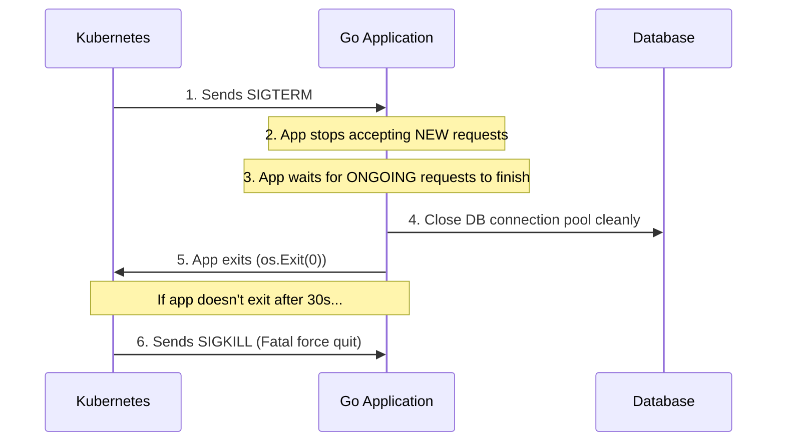

## TL;DR

When you deploy a Go app to Kubernetes, pods are constantly created and destroyed. If you don't handle OS signals, Kubernetes will terminate your app instantly, severing active user connections and corrupting database transactions. You must implement a **Graceful Shutdown** to intercept the `SIGTERM` signal and finish pending work safely.

## Mental Model



## How It Works

1. **The Signal:** Kubernetes sends a `SIGTERM` (Signal Terminate) to PID 1 of your container.
2. **The Catch:** Your Go application uses `os/signal.Notify` to catch this signal.
3. **The Shutdown Phase:** 
   - You call `server.Shutdown()` on your HTTP server.
   - You wait for background Worker Pools to finish.
   - You call `db.Close()` to flush data and sever DB connections.
4. **The Deadline:** Kubernetes has a `terminationGracePeriodSeconds` (default 30s). Your Go application must set its internal shutdown timeout to something slightly *less* (e.g., 25s) so it can print a clean error log before Kubernetes resorts to a violent `SIGKILL`.

## Example

```go
package main

import (
	"context"
	"fmt"
	"os"
	"os/signal"
	"syscall"
	"time"
)

func main() {
	// 1. Create a channel to receive OS signals
	// It must be buffered (size 1) so the OS doesn't block while sending!
	quit := make(chan os.Signal, 1)

	// 2. Tell the OS to route SIGINT (Ctrl+C) and SIGTERM (Kubernetes) to our channel
	signal.Notify(quit, os.Interrupt, syscall.SIGTERM)

	// ... Start HTTP server in a background goroutine ...

	// 3. The main thread blocks here forever until a signal arrives
	sig := <-quit
	fmt.Printf("Received signal: %v. Starting graceful shutdown...\n", sig)

	// 4. Set a hard timeout for the shutdown process (25s)
	ctx, cancel := context.WithTimeout(context.Background(), 25*time.Second)
	defer cancel()

	// 5. Perform cleanup
	// e.g., if err := server.Shutdown(ctx); err != nil { ... }
	// e.g., db.Close()
	
	// Simulate cleanup taking time
	time.Sleep(2 * time.Second) 
	
	fmt.Println("Cleanup finished. Exiting.")
}
```

## Common Interview Questions

### Can you catch a `SIGKILL`?
No. `SIGKILL` (Signal 9) is handled directly by the Linux kernel. It instantly destroys the process without warning. You cannot intercept it, defer functions will not run, and cleanup will not happen. This is why you must handle `SIGTERM` properly to avoid the `SIGKILL`.

### Why does my app still drop traffic even with Graceful Shutdown in K8s?
In Kubernetes, when a pod is marked for termination, K8s sends the `SIGTERM` to the pod, BUT it *also* asynchronously updates the networking rules (iptables) to remove the pod from the Load Balancer. If your app shuts down *faster* than the network rules update, the Load Balancer will still route new requests to a dead pod! 
**The Fix:** Add a `time.Sleep(5 * time.Second)` at the very beginning of your graceful shutdown sequence to give K8s time to update its networking rules before you actually stop your HTTP server.
