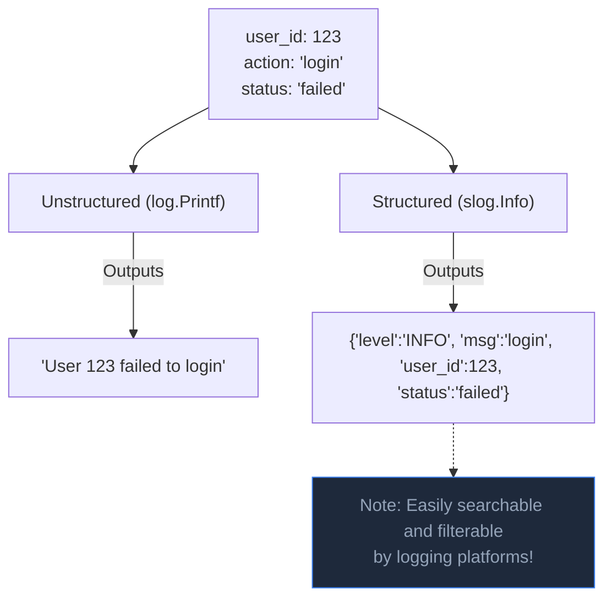

## TL;DR

The standard `log.Println` package writes plain text strings to standard output. In modern production environments (using Datadog, ELK, or Splunk), logs must be machine-readable JSON. Go 1.21 introduced `log/slog` for built-in **Structured Logging**, replacing the need for popular third-party libraries like `zap` or `logrus` in many cases.

## Mental Model



## How It Works

Structured logging treats a log entry as an Event Object with specific fields (key-value pairs), rather than a sentence.

When debugging a production outage, you don't want to run massive Regex queries across terabytes of text logs looking for "failed to login user \d+". You want to write a strict query: `SELECT * FROM logs WHERE action = 'login' AND status = 'failed'`. 

## Example

```go
package main

import (
	"log/slog"
	"os"
)

func main() {
    // 1. Setup the global logger to output JSON to Standard Out
    // We set the logging level to DEBUG
	logger := slog.New(slog.NewJSONHandler(os.Stdout, &slog.HandlerOptions{
		Level: slog.LevelDebug, 
	}))
	
	// Set it as the default logger for the whole application
	slog.SetDefault(logger)

    // 2. Writing a simple log
	slog.Info("Server started", "port", 8080)
	// Output: {"time":"2023-10-15T...","level":"INFO","msg":"Server started","port":8080}

    // 3. Writing a log with complex context
    userID := 42
    err := doSomethingDangerous()
    
	if err != nil {
		slog.Error("Failed to process transaction",
			"user_id", userID,
			"attempt", 3,
			"error", err.Error(), // Always include the actual error!
		)
	}
}

func doSomethingDangerous() error { return nil }
```

## Common Interview Questions

### Should I log to a file or Standard Out (`os.Stdout`)?
In modern cloud-native environments (Docker / Kubernetes), you should **always** log to Standard Out (`os.Stdout`) and Standard Error (`os.Stderr`). You should not manage log files, rotation, or compression within your Go app. The container runtime (like Docker or containerd) will capture the stdout streams and forward them to a centralized logging agent (like Fluentbit or Promtail).

### How does `slog` compare to `uber-go/zap`?
`zap` is famous for being aggressively optimized for zero-allocation, extremely high-throughput performance. `slog` is the new standard library solution; it is very fast, but `zap` is still technically faster for extreme edge cases. However, the true power of `slog` is that library authors can now write structured logs using the standard library without forcing their users to install a specific third-party logging framework.
