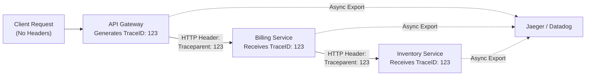

## TL;DR

If a user clicks "Checkout" and the request hits the API Gateway, which calls the Billing Service, which calls the Inventory Service, which fails... how do you debug it? **Distributed Tracing** (via OpenTelemetry) injects a unique "Trace ID" into the HTTP Headers. This ID is passed along through every service, allowing tools like Jaeger or Datadog to stitch the entire flow together into a single visual timeline.

## Mental Model



## How It Works

Tracing relies entirely on the `context.Context` object in Go.
When a request enters your Go app:
1. OpenTelemetry middleware extracts the Trace ID from the incoming HTTP Headers.
2. It injects the Trace ID into the `context.Context`.
3. You pass the `ctx` down through every function.
4. When your app makes a database query or an outgoing HTTP request, the OpenTelemetry client intercepts the `ctx`, extracts the Trace ID, and injects it into the outgoing database payload or HTTP Headers.

A **Trace** represents the entire journey. A **Span** represents a single step in that journey (e.g., "Postgres Query" or "Parse JSON").

## Example (Conceptual OpenTelemetry)

```go
package main

import (
	"context"
	"net/http"
	"go.opentelemetry.io/otel"
)

// A global tracer instance
var tracer = otel.Tracer("my-microservice")

func handleCheckout(w http.ResponseWriter, r *http.Request) {
    // 1. Start a new "Span" (This automatically attaches to the parent Trace ID
    // if one was extracted from the HTTP headers by middleware)
	ctx, span := tracer.Start(r.Context(), "ProcessCheckout")
	defer span.End() // Crucial: Ends the timer and exports the data!

	// 2. Pass the modified context down
	err := deductInventory(ctx, "item_42")
	if err != nil {
	    // 3. Attach metadata to the span
		span.RecordError(err) 
		http.Error(w, "Failed", 500)
		return
	}

	w.Write([]byte("Success"))
}

func deductInventory(ctx context.Context, itemID string) error {
    // Create a sub-span for the database call
	ctx, span := tracer.Start(ctx, "DB: Deduct Inventory")
	defer span.End()
	
	// Simulate DB work...
	return nil
}
```

## Common Interview Questions

### Why is `context.Context` so critical for Tracing?
Because Go does not have "Thread Local Storage" (variables that magically float around in the background of a thread like in Java). If you don't explicitly pass the `ctx` through every function as an argument, the Trace ID is lost, and the tracing chain is broken.

### What is Trace Sampling?
If you process 10,000 requests per second, exporting trace data for every single request will use massive amounts of bandwidth and storage. **Sampling** tells the OpenTelemetry SDK to only record and export a percentage of traces (e.g., 1%). You usually configure "Tail-Based Sampling" in production, which discards 99% of successful traces, but forces the system to record 100% of the traces that end in an error.
