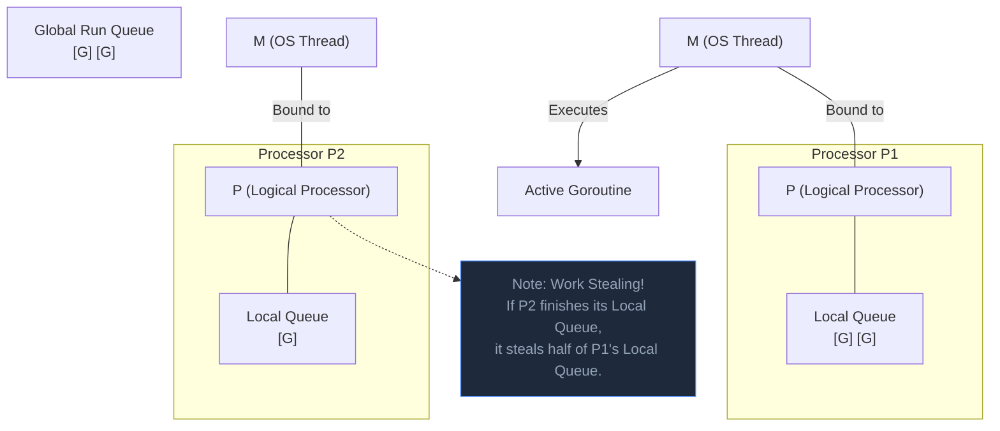

## TL;DR

The Go Scheduler operates on three core entities: **G** (Goroutine), **M** (Machine / OS Thread), and **P** (Processor / Logical Context). Understanding how these three interact is the key to mastering advanced Go concurrency interviews.

## Mental Model



## How It Works

1. **G (Goroutine)**: Contains the stack, instruction pointer, and status (Runnable, Waiting, Running).
2. **M (Machine)**: An actual OS Thread managed by the kernel. It executes the code.
3. **P (Processor)**: A logical context. Think of it as a bucket of resources. It contains the **Local Run Queue** (a queue of max 256 Goroutines waiting to run) and a local memory cache (`mcache`). The number of `P`s is determined by `GOMAXPROCS`.

**The Golden Rule:** An `M` MUST acquire a `P` to execute any Go code. 

### The Workflow:
- The `M` looks at its attached `P`'s Local Queue, grabs a `G`, and runs it.
- If the `P`'s Local Queue is empty, the `M` will look at the Global Queue.
- **Work Stealing**: If the Global Queue is also empty, the `M` will look at a completely different `P` and *steal* half of its Goroutines! This perfectly balances the load across all CPU cores.

## Example (Visualizing GMP)

You can view the real-time interaction of Gs, Ms, and Ps by generating a trace file and opening it in the browser.

```go
package main

import (
	"os"
	"runtime/trace"
)

func main() {
    // 1. Start writing trace data to a file
	f, _ := os.Create("trace.out")
	defer f.Close()
	trace.Start(f)
	defer trace.Stop()

    // 2. Do some concurrent work
	ch := make(chan int)
	go func() { ch <- 42 }()
	<-ch
}

// Run: go run main.go
// Then open it: go tool trace trace.out
```
*The resulting web UI will show you exactly which 'P' executed which 'G' on which 'M'.*

## Common Interview Questions

### Why does Go have a `P`? Why not just assign `G`s directly to `M`s?
If `G`s were assigned directly to OS Threads (`M`s), every time a Goroutine was created or finished, the OS Threads would have to lock a massive global Mutex to grab the next job. This causes immense contention. By having a `P` with a *Local* Queue, the OS Thread can grab its next job lock-free! Furthermore, if an `M` blocks entirely on a CGO call, the Go runtime can instantly detach the `P` from the blocked `M`, spin up a fresh `M`, attach the `P` to it, and keep executing the local queue without missing a beat.

### What is the Global Run Queue?
When a `P`'s Local Queue hits its maximum capacity of 256 goroutines, any new goroutines spill over into the Global Run Queue. Because the Global Queue is shared across all cores, accessing it requires a Mutex lock, making it slower. To prevent goroutines in the Global Queue from starving, every `P` will occasionally check the Global Queue before its own Local Queue.
