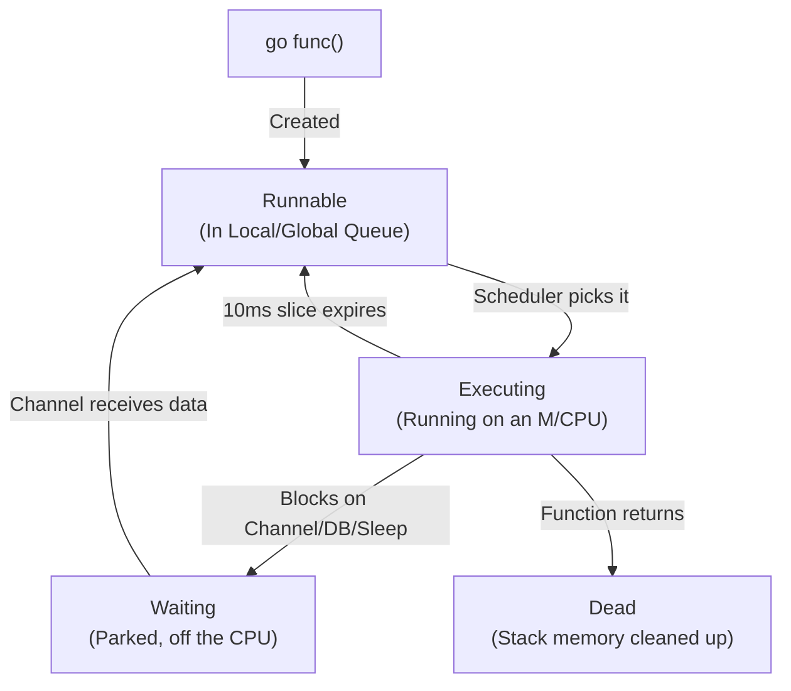

## TL;DR

A Goroutine is a state machine. It transitions between three primary states: **Runnable** (waiting in a queue), **Executing** (running on a CPU core), and **Waiting** (blocked on I/O, channels, or timers). The Go Scheduler is responsible for managing these state transitions.

## Mental Model



## How It Works

1. **Creation**: When you type `go func()`, the runtime allocates a 2KB stack and wraps the function in a `G` struct. It is placed into a Local Queue (`P`) in the **Runnable** state.
2. **Executing**: An OS thread (`M`) pulls the `G` from the queue and executes its assembly instructions.
3. **Waiting**: If the code hits `time.Sleep()`, `<-ch`, or `db.Query()`, the Goroutine is "parked". It is removed from the OS thread entirely. Its state is saved (registers and stack). It is now **Waiting**. The OS thread immediately grabs the next Runnable Goroutine.
4. **Resuming**: When the database replies, the network poller wakes up the Goroutine, changes it back to **Runnable**, and puts it back in a queue.

## Example

You can't observe these states directly in code, but understanding them is crucial for reading blocking profiles.

```go
package main

import (
	"fmt"
	"time"
)

func main() {
	// 1. Created -> Runnable -> Executing
	go func() {
		fmt.Println("Step 1: Running on CPU")

		// 2. Executing -> Waiting
		// The scheduler detaches this G from the M.
		time.Sleep(1 * time.Second)

		// 3. Waiting -> Runnable -> Executing
		fmt.Println("Step 2: Woke up, back on CPU")
		
		// 4. Executing -> Dead
	}()

	time.Sleep(2 * time.Second)
}
```

## Common Interview Questions

### What causes a Goroutine to become "Waiting"?
- Reading/Writing to an Unbuffered Channel or a full Buffered Channel.
- Acquiring a locked `sync.Mutex`.
- Network I/O (e.g., waiting for an HTTP response).
- `time.Sleep()` or waiting on a timer.

### What is "Goroutine Starvation"?
If you have 4 CPU cores, and you spawn 4 Goroutines that run infinite `for{}` loops doing pure math (no network calls, no sleeps), they will stay in the **Executing** state. Before Go 1.14, this would starve all other Goroutines in the Runnable queue because the running ones never "yielded". Modern Go fixes this with asynchronous preemption, forcing them to transition back to Runnable every 10 milliseconds to give others a turn.
