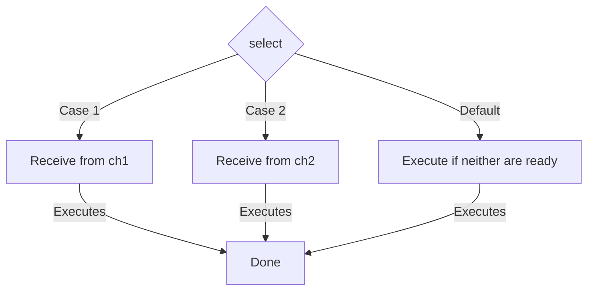

## TL;DR

The `select` statement lets a goroutine wait on multiple communication operations (channel sends or receives). It blocks until one of its cases can run, then it executes that case.

## Mental Model



## Example

```go
package main

import (
	"fmt"
	"time"
)

func main() {
	ch1 := make(chan string)
	ch2 := make(chan string)

	go func() {
		time.Sleep(1 * time.Second)
		ch1 <- "one"
	}()
	go func() {
		time.Sleep(2 * time.Second)
		ch2 <- "two"
	}()

	// Select blocks until one channel is ready
	for i := 0; i < 2; i++ {
		select {
		case msg1 := <-ch1:
			fmt.Println("Received", msg1)
		case msg2 := <-ch2:
			fmt.Println("Received", msg2)
		}
	}
}
```

## How It Works

1.  **Blocking**: Without a `default` case, `select` blocks until at least one of the channels is ready to send or receive.
2.  **Random Selection**: If *multiple* channels are ready at the same time, `select` chooses one at random. This prevents starvation of cases further down the code.
3.  **Non-Blocking Select**: Adding a `default` case makes the select non-blocking. If no channels are ready immediately, the default case executes.

## Interview Questions

### How do you implement a timeout using `select`?
By using `time.After()`, which returns a channel that sends the current time after a specified duration.
```go
select {
case res := <-resultChan:
    fmt.Println(res)
case <-time.After(3 * time.Second):
    fmt.Println("Timeout!")
}
```

### What happens if you run an empty `select {}`?
It blocks forever. This is sometimes used intentionally to keep the `main` goroutine running indefinitely while background goroutines do work (though `sync.WaitGroup` is usually better).

## Common Gotchas

*   **Busy Waiting**: A `select` statement with a `default` case inside an infinite `for` loop will consume 100% of a CPU core because it constantly evaluates the default case without sleeping.

## Remember

> `select` is the switch statement for concurrency. It is the backbone of almost all complex concurrent Go programs.
