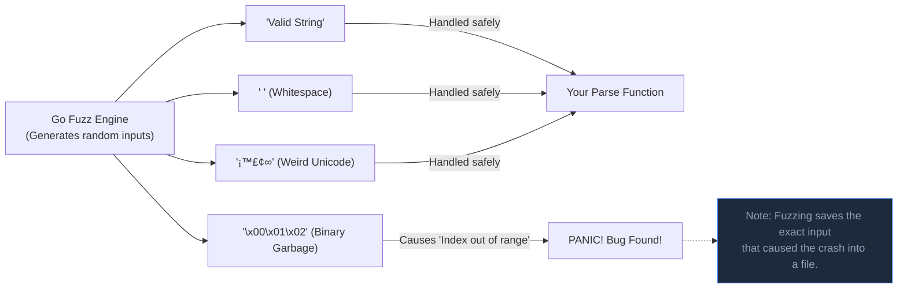

## TL;DR

Introduced natively in Go 1.18, **Fuzzing** is an automated testing technique. Instead of you writing specific test cases (`Input: 4, Expected: true`), the Fuzz engine generates millions of randomized, mutated, and malformed inputs (strings, bytes, ints) and feeds them into your function to see if it causes a panic or an out-of-bounds crash.

## Mental Model



## How It Works

Humans are bad at imagining edge cases (like what happens if a string contains Arabic characters, zero-width spaces, or null terminators). Fuzzing explores these automatically.

1. Function must start with `Fuzz` (e.g., `FuzzParseData`).
2. Accepts `f *testing.F`.
3. You provide a "Seed Corpus" (a few valid examples using `f.Add()`).
4. You call `f.Fuzz(func(t *testing.T, data string) { ... })`.
5. The Fuzz engine takes your seed examples, mutates them in weird ways, and passes them to your function.

## Example

Imagine we wrote a function that reverses a string.

```go
package stringsutil

import (
	"testing"
	"unicode/utf8"
)

// The function we are testing
func Reverse(s string) string {
	b := []byte(s)
	for i, j := 0, len(b)-1; i < j; i, j = i+1, j-1 {
		b[i], b[j] = b[j], b[i]
	}
	return string(b)
}

func FuzzReverse(f *testing.F) {
	// 1. Provide a "Seed Corpus" (starting points)
	f.Add("hello")
	f.Add("racecar")

	// 2. The Fuzz Loop
	// The engine will generate random strings and pass them into 'orig'
	f.Fuzz(func(t *testing.T, orig string) {
		
		// Run the function
		rev := Reverse(orig)
		
		// We can't check 'expected output' because the input is random!
		// Instead, we check properties that should ALWAYS be true:
		
		// Property 1: Reversing it twice should equal the original
		doubleRev := Reverse(rev)
		if orig != doubleRev {
			t.Errorf("Before: %q, After double reverse: %q", orig, doubleRev)
		}
		
		// Property 2: It should still be valid UTF-8
		if utf8.ValidString(orig) && !utf8.ValidString(rev) {
			t.Errorf("Reverse produced invalid UTF-8 string %q", rev)
		}
	})
}
```

**Running the Fuzzer:**
`go test -fuzz=FuzzReverse`
*(It will run infinitely until it finds a bug, or until you stop it with Ctrl+C).*

## Common Interview Questions

### What happens when the Fuzzer finds a bug?
If your code panics or a `t.Errorf` is triggered, the Fuzzer stops immediately. It takes the exact random input that caused the crash and saves it to a file inside the `testdata/fuzz/` directory. From then on, every time you run standard `go test`, it will automatically run that specific failing input to ensure you actually fixed the bug and it never regresses!

### Why is our `Reverse` function example actually buggy?
If the fuzzer passes a multi-byte Unicode character (like an Emoji 🚀 or Chinese character), our `Reverse` function flips the raw bytes blindly. This destroys the multi-byte encoding, resulting in invalid garbage characters ``. The Fuzzer will catch this instantly because of our `utf8.ValidString` check!
