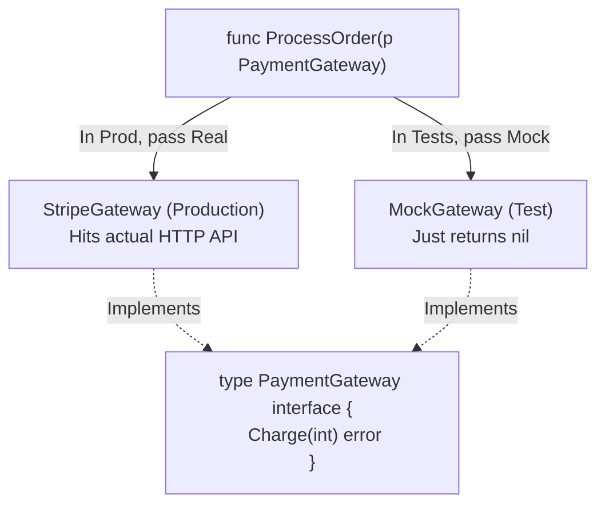

## TL;DR

Go does not have "magic" mocking frameworks that intercept network calls or override classes like Python or Jest. In Go, mocking is done entirely via **Interfaces**. If a function requires an interface, you simply pass it a fake struct that implements that interface for testing purposes.

## Mental Model



## How It Works

If your `ProcessOrder` function creates a `StripeClient` directly inside its body, it is untestable. You must use **Dependency Injection**. The function should accept an interface (`PaymentGateway`) as an argument. 

In production, you pass the real Stripe struct.
In testing, you create a custom `MockGateway` struct in your test file that hardcodes the response you want (e.g., returning a fake success, or simulating a network error).

## Example

```go
// --- production_code.go ---
package payments

import "errors"

// 1. Define the Interface
type PaymentGateway interface {
	Charge(amount int) error
}

// 2. The function relies ONLY on the interface
func ProcessOrder(gateway PaymentGateway, amount int) error {
	if amount <= 0 {
		return errors.New("invalid amount")
	}
	
	// Calls the interface method
	return gateway.Charge(amount)
}

// --- production_code_test.go ---
package payments

import "testing"

// 3. Create a Mock Struct for testing
type MockGateway struct {
	ShouldFail bool
	ChargeCalled bool
}

// 4. Implement the interface method on the Mock
func (m *MockGateway) Charge(amount int) error {
	m.ChargeCalled = true // Track that the method was actually called
	if m.ShouldFail {
		return errors.New("simulated network failure")
	}
	return nil
}

func TestProcessOrder_Success(t *testing.T) {
	// 5. Inject the Mock!
	mock := &MockGateway{ShouldFail: false}
	
	err := ProcessOrder(mock, 100)
	
	if err != nil {
		t.Errorf("Expected success, got %v", err)
	}
	if !mock.ChargeCalled {
		t.Errorf("Expected Charge() to be called on the gateway!")
	}
}
```

## Common Interview Questions

### Should I use tools like `gomock` or `testify/mock`?
For simple interfaces (1-3 methods), handwriting a mock struct is the "Go Way" because it's transparent and easy to read. However, if you are mocking massive interfaces (like a database repository with 20 methods), handwriting mocks becomes tedious. In that case, using `uber-go/mock` (formerly `gomock`) or `testify` to auto-generate the mock structs is highly recommended.

### Who should define the Interface? The Producer or the Consumer?
In Go, **Interfaces should be defined by the Consumer**. If you import the Stripe SDK, you do *not* use Stripe's massive interface. You define your own tiny interface `type Charger interface { Charge() }` right next to the function that needs it, and pass the Stripe struct into it. This keeps your mocks incredibly small and easy to write.
