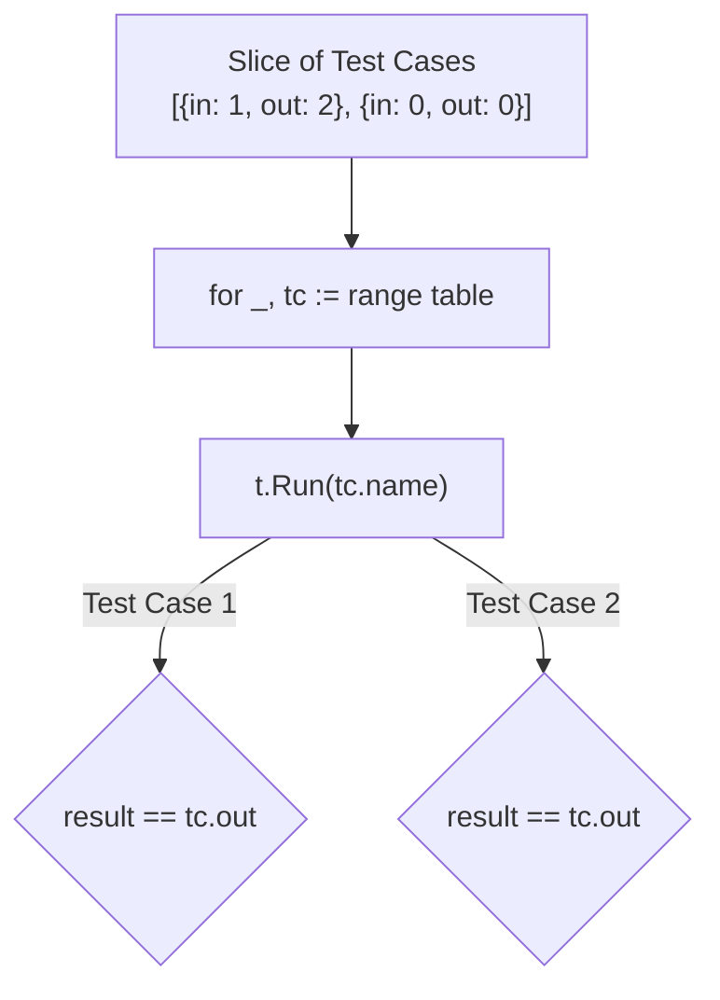

## TL;DR

Instead of writing five separate test functions to test five different inputs for the same function, Go heavily promotes **Table-Driven Tests**. You define an array of structs (the "Table"), where each struct represents a single test case (Inputs + Expected Outputs). You then iterate over the array using a `for` loop.

## Mental Model



## How It Works

A table-driven test relies on **Subtests** using `t.Run(name, func(t *testing.T))`. 

When you use `t.Run()`, Go treats each iteration of the loop as a completely independent sub-test. If Test Case #2 fails, the loop continues and Test Case #3 still runs. When you look at the test output, it clearly displays the name of the exact subtest that failed.

## Example

```go
package mathutil

import "testing"

func TestIsEven(t *testing.T) {
	// 1. Define the Table (a slice of anonymous structs)
	tests := []struct {
		name     string // A descriptive name for the subtest
		input    int
		expected bool
	}{
		{"positive even", 4, true},
		{"positive odd", 5, false},
		{"zero", 0, true},
		{"negative even", -2, true},
		{"negative odd", -3, false},
	}

	// 2. Iterate over the Table
	for _, tc := range tests {
		// 3. Launch a subtest
		t.Run(tc.name, func(t *testing.T) {
			result := IsEven(tc.input)
			
			if result != tc.expected {
				t.Errorf("IsEven(%d) = %v; expected %v", tc.input, result, tc.expected)
			}
		})
	}
}
```

**Output of `go test -v`:**
```text
=== RUN   TestIsEven
=== RUN   TestIsEven/positive_even
=== RUN   TestIsEven/positive_odd
=== RUN   TestIsEven/zero
--- PASS: TestIsEven (0.00s)
    --- PASS: TestIsEven/positive_even (0.00s)
    --- PASS: TestIsEven/positive_odd (0.00s)
    --- PASS: TestIsEven/zero (0.00s)
```

## Common Interview Questions

### Can Table-Driven tests run concurrently?
Yes! If you add `t.Parallel()` inside the `t.Run()` block, Go will run all the subtests concurrently. 
**However, there is a massive trap here.** If you use `t.Parallel()` inside a `for` loop, you *must* capture the loop variable locally inside the loop before passing it to the subtest (`tc := tc`), otherwise all concurrent subtests will end up evaluating only the very last item in the table! *(Note: Go 1.22 finally fixed this loop variable quirk, but in older versions, it is the #1 cause of flaky tests).*

### Why is Table-Driven Testing better than individual functions?
1. **DRY Code**: You only write the Assert logic once.
2. **Easy Expansion**: If a user reports a weird edge-case bug (e.g., "It breaks when input is 99"), you don't need to write a whole new function. You just add one single line `{"bug report 123", 99, false}` to the table slice!
