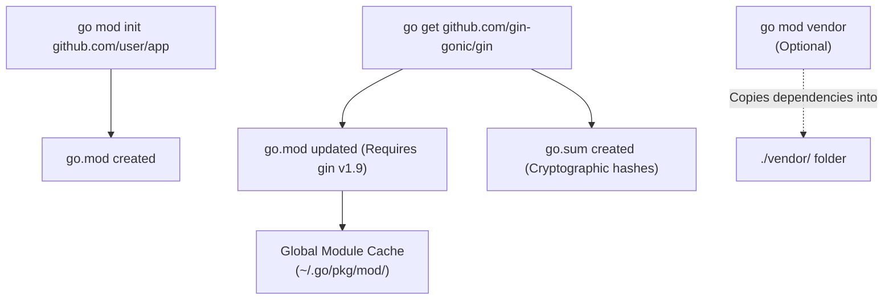

## TL;DR

**Go Modules** (`go.mod`) is the official dependency management system (like `package.json` in Node.js). It guarantees repeatable builds by tracking the exact versions of external libraries your project uses, and cryptographically verifying them via `go.sum`.

## Mental Model



## How It Works

### The Core Files
1. **`go.mod`**: Lists your project's module path, the Go version required, and your direct dependencies.
2. **`go.sum`**: Contains cryptographic hashes of the specific commits/tags you downloaded. If a malicious actor compromises GitHub and changes the code of a specific tag, the hash will mismatch, and the Go compiler will instantly reject the build.

### Core Commands
- `go mod init <module-name>`: Starts a new project.
- `go get <package>`: Downloads a package and adds it to `go.mod`.
- `go mod tidy`: The most important command! It scans your entire codebase. Any package you `import` is automatically added to `go.mod`. Any package in `go.mod` that you are *no longer using* is automatically removed. Run this before every commit!

## Example: The go.mod file

```go
// The global name of your module (used for imports)
module github.com/myusername/myproject

// The version of the Go compiler expected
go 1.21

// Direct dependencies
require (
	github.com/gin-gonic/gin v1.9.1
	github.com/joho/godotenv v1.5.1
)

// Indirect dependencies (dependencies of your dependencies)
require (
	github.com/go-playground/validator/v10 v10.14.0 // indirect
	golang.org/x/crypto v0.9.0 // indirect
)
```

## Common Interview Questions

### What does `go mod vendor` do, and should I use it?
By default, Go downloads dependencies to a hidden global cache on your machine (`$GOPATH/pkg/mod`). 
Running `go mod vendor` copies all those dependencies into a literal folder named `vendor/` inside your project directory. 
**Should you use it?** In modern Go, usually not. It bloats your git repository. However, enterprise environments use it to guarantee they still have the source code even if GitHub goes down, or if the original author deletes the repository (the "left-pad" problem).

### What is the `replace` directive in `go.mod`?
Sometimes you find a bug in an open-source library, fork it, and fix it. You can use the `replace` directive at the bottom of `go.mod` to tell the compiler: "Whenever the code asks for the original library, silently swap it out for my local folder or my fork."
`replace github.com/original/lib => ../my-local-fork`
