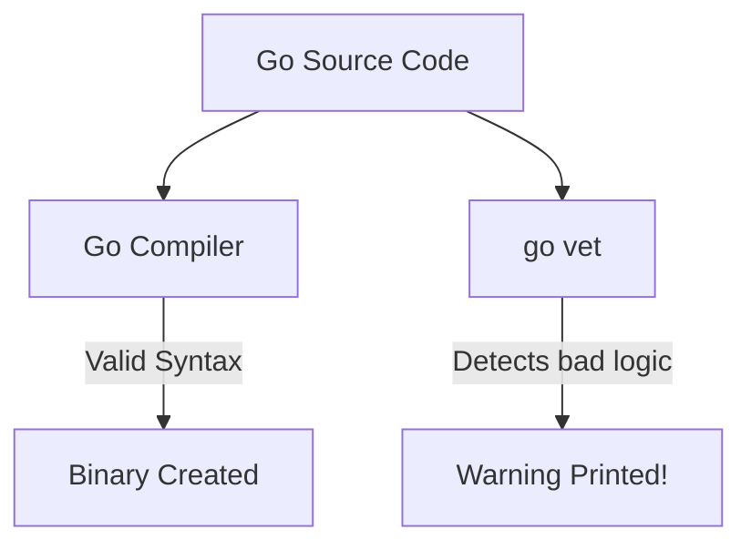

## TL;DR

`go vet` is a static analysis tool built into the Go compiler. It examines your code to find logic bugs that are technically valid syntax (so the compiler won't fail), but are almost certainly mistakes. It runs automatically during `go test`, and you should run it in your CI/CD pipelines.

## Mental Model



## How It Works

Because `go vet` is part of the standard toolchain, you don't need to install anything. 
It looks for very specific patterns:

1. **`Printf` format strings**: Passing an `int` to a `%s` verb.
2. **Unreachable code**: Code that exists after a `return` or `panic`.
3. **Mutex copies**: Passing a `sync.Mutex` by value instead of by pointer (which destroys the lock).
4. **Loop Variables**: Capturing loop variables incorrectly in goroutines (though Go 1.22 fixed this at the compiler level).
5. **Shadowing**: Accidentally declaring a new variable with the same name as an existing one in an inner scope.

## Example

```go
package main

import (
	"fmt"
	"sync"
)

// Bug 1: Passing a Mutex by VALUE instead of pointer.
// This copies the lock, rendering it useless.
func process(mu sync.Mutex) {
	mu.Lock()
	defer mu.Unlock()
}

func main() {
    // Bug 2: Printf mismatch. 'name' is a string, but %d expects an integer.
	name := "Alice"
	fmt.Printf("Hello %d\n", name) 
}
```

If you just run `go build`, the compiler might let this pass (though modern Go versions are getting stricter). 
If you run `go vet main.go`, it instantly catches both bugs:
```text
# command-line-arguments
./main.go:10:14: process passes lock by value: sync.Mutex
./main.go:17:2: fmt.Printf format %d has arg name of wrong type string
```

## Common Interview Questions

### If `go vet` catches bugs, why doesn't the compiler just reject the code?
The compiler's job is strictly to check syntax and type safety, and to do it as fast as possible. `go vet` does a deeper semantic analysis which requires more CPU time. Furthermore, sometimes (rarely) you *want* to do something that `go vet` warns against. Keeping them separate ensures the compiler stays fast and unopinionated.

### How is `go vet` different from `golangci-lint`?
`go vet` is official, extremely fast, and only flags things that are 99.9% guaranteed to be bugs. It has zero false positives. `golangci-lint` is a third-party tool that aggregates dozens of community linters. It is much more opinionated, checking for code style, complexity, naming conventions, and performance tweaks.
