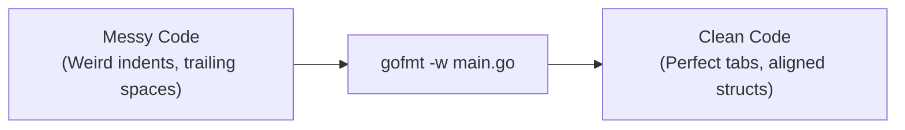

## TL;DR

In JavaScript or Python, teams spend hours arguing over tabs vs. spaces, line lengths, and bracket placements. They set up complex Prettier or Black configs. Go solved this by inventing `gofmt`. It is a built-in formatting tool with strict, unchangeable rules. **All Go code in the world looks exactly the same.**

## Mental Model



## How It Works

`gofmt` parses your source code into an Abstract Syntax Tree (AST) and then prints it back out using standard formatting rules. 

**The Rules (You cannot change them):**
- Indentation is strictly done with **Tabs**, not spaces.
- Braces `{` must be on the same line as the statement, not the next line.
- Imports are sorted alphabetically.
- Struct fields and variable declarations are vertically aligned.

Every modern IDE (VSCode, GoLand) is configured to run `gofmt` (or `goimports`, a slightly smarter wrapper) every time you press Ctrl+S. 

## Example

**Before (Messy):**
```go
package main
import "fmt"
func main()      {
x:=10
  if x==10
{
fmt.Println("Ten")}
}
```

**Run the tool:**
`gofmt -w main.go`

**After (Perfect):**
```go
package main

import "fmt"

func main() {
	x := 10
	if x == 10 {
		fmt.Println("Ten")
	}
}
```

## Common Interview Questions

### What is the difference between `gofmt` and `goimports`?
`gofmt` only formats the syntax. `goimports` does everything `gofmt` does, PLUS it automatically manages your `import` statements. If you type `fmt.Println()`, `goimports` will automatically add `"fmt"` to the top of the file. If you delete the print statement, it will automatically remove `"fmt"` from the imports so the compiler doesn't complain. `goimports` is the industry standard for IDE integration.

### What does the `go fmt` command do?
`go fmt` is just a convenient wrapper around `gofmt`. While `gofmt` requires you to specify specific files or directories, running `go fmt ./...` will format your entire project automatically.
