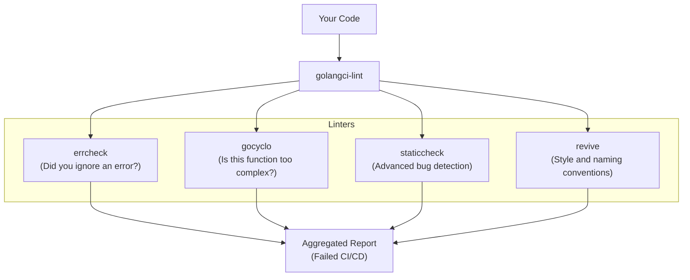

## TL;DR

While `gofmt` handles formatting and `go vet` handles critical bugs, **Linters** handle stylistic choices, code complexity, and best practices. Because the Go community created hundreds of separate, tiny linters, the industry standard is to use **`golangci-lint`**, a massive runner that executes dozens of linters in parallel at lightning speed.

## Mental Model



## How It Works

You install `golangci-lint` locally or in your GitHub Actions CI pipeline. 
You create a `.golangci.yml` configuration file in the root of your project to explicitly enable or disable specific linters.

When you run it, it parses the AST once and feeds it to all the enabled linters concurrently. It is incredibly fast.

## Example Configuration

A common `.golangci.yml` file:

```yaml
linters-settings:
  errcheck:
    # Report about not checking of errors in type assertions: `a := b.(MyStruct)`
    check-type-assertions: true
  gocyclo:
    # Minimal complexity to report
    min-complexity: 15

linters:
  disable-all: true
  enable:
    - errcheck      # Ensures every returned error is checked
    - govet         # The standard go vet tool
    - staticcheck   # The gold standard for Go static analysis
    - revive        # Replaces golint (style checking)
    - gocyclo       # Warns if a function has too many if/else branches
    - gosec         # Scans for security vulnerabilities (e.g., weak crypto)
```

**Running the linter:**
`golangci-lint run ./...`

## Common Interview Questions

### What happens if I want to ignore a linter warning for one specific line?
You can use a special comment directive directly above the line of code.
```go
// nolint:errcheck // We intentionally ignore the error here because it's a mock
_ = doSomething()
```

### What is `staticcheck`?
`staticcheck` is so powerful that it's often considered the "unofficial official" linter for Go. While `go vet` finds basic bugs, `staticcheck` finds incredibly complex issues: using deprecated standard library functions, ineffective assignments, useless regular expressions, and concurrency bugs. It is highly recommended to have it enabled in every Go project.
