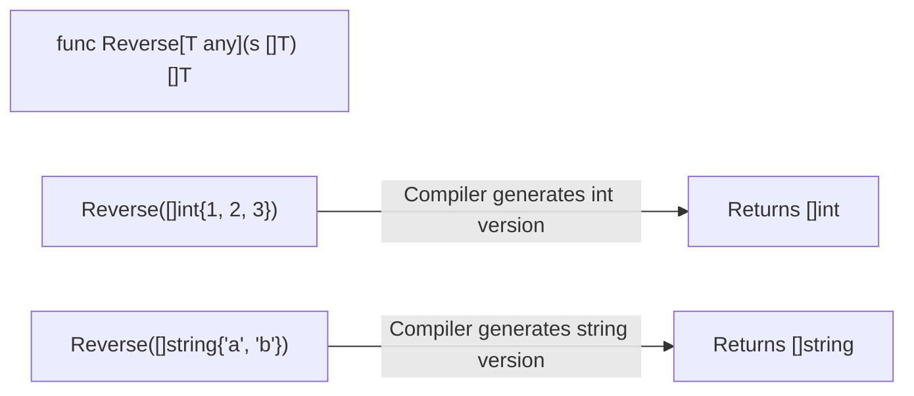

## TL;DR

Introduced in Go 1.18, **Generics** allow you to write functions and structs that can operate on multiple types without having to use the dangerous `interface{}` (any) type. You define a "Type Parameter" (like `[T any]`) which the compiler fills in at compile time.

## Mental Model



## How It Works

Before generics, if you wanted to write a function that reverses an array, you had to write `ReverseInts`, `ReverseStrings`, `ReverseFloats`, etc. Or, you used `[]any`, which bypassed the compiler's safety checks completely.

With generics, you define Type Parameters in square brackets `[T any]`. 
- `T` is the generic variable name.
- `any` is the **Constraint**. It means `T` can be absolutely anything.

Go also provides built-in constraints like `comparable` (types that can be used with `==`, like strings and numbers) which is required if you want to use generics as keys in a map.

## Example

```go
package main

import "fmt"

// 1. A Generic Function
// T can be any type. The function takes a slice of T and returns a slice of T.
func Reverse[T any](s []T) []T {
	result := make([]T, len(s))
	for i, v := range s {
		result[len(s)-1-i] = v
	}
	return result
}

// 2. A Generic Struct
// A Stack data structure that can hold any specific type.
type Stack[T any] struct {
	items []T
}

func (s *Stack[T]) Push(item T) {
	s.items = append(s.items, item)
}

func main() {
    // We don't even need to write Reverse[int], Go infers the type!
	ints := Reverse([]int{1, 2, 3})
	fmt.Println(ints) // [3 2 1]

	strings := Reverse([]string{"apple", "banana"})
	fmt.Println(strings) // ["banana" "apple"]

    // For structs, we must define the type explicitly
	intStack := Stack[int]{}
	intStack.Push(42)
}
```

## Common Interview Questions

### What does the `comparable` constraint do?
If you write `func Find[T any](arr []T, target T)`, and inside the function you write `if arr[i] == target`, the compiler will throw an error! Why? Because if `T` was a slice or a map, you can't compare them using `==` in Go. To fix this, you change the constraint to `[T comparable]`. This tells the compiler to reject any types that don't support `==`.

### How do Generics impact performance in Go?
Unlike Java (which uses Type Erasure), Go uses a technique called **Monomorphization** combined with "GC shape stenciling". Essentially, the Go compiler generates a separate, highly optimized copy of the function for each underlying type layout used (e.g., one for pointers, one for integers). This means Generics in Go have virtually zero runtime performance penalty, but they can slightly increase the size of the compiled binary and the compilation time.
