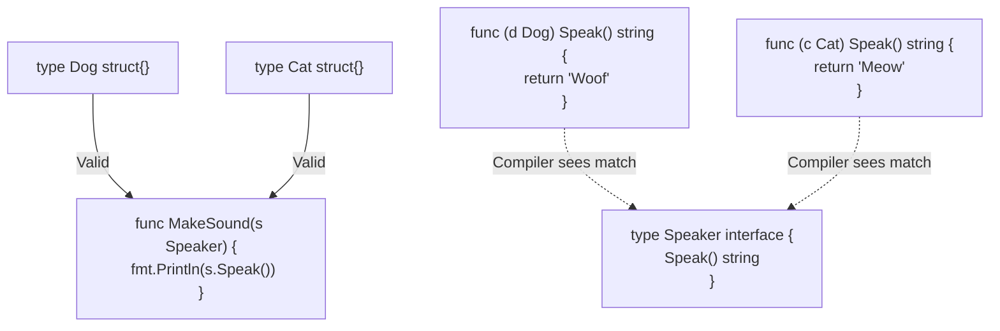

## TL;DR

An **Interface** in Go defines a set of method signatures (a contract). What makes Go unique is that interfaces are implemented **implicitly**. A struct does not declare `implements InterfaceName`. If a struct has all the methods required by the interface, it automatically implements it.

## Mental Model



## How It Works

Interfaces decouple your code. Instead of writing a function that specifically requires a `StripeClient` or `PayPalClient`, you write a function that requires a `PaymentProcessor` interface (which has a `Charge()` method). 

Because implementation is implicit (Structural Typing / Duck Typing), you can write an interface that fits a struct from a third-party library without modifying the library's code!

## Example

```go
package main

import "fmt"

// 1. Define the Interface
type Notifier interface {
	SendNotification(msg string) error
}

// 2. A concrete type
type EmailService struct { email string }

// 3. The EmailService implicitly implements Notifier!
func (e EmailService) SendNotification(msg string) error {
	fmt.Printf("Sending email to %s: %s\n", e.email, msg)
	return nil
}

// 4. A function that accepts ANY type that satisfies Notifier
func AlertUser(n Notifier, message string) {
	n.SendNotification(message)
}

func main() {
	svc := EmailService{email: "admin@corp.com"}
	// Valid, because EmailService has the required method
	AlertUser(svc, "Server is down!") 
}
```

## Common Interview Questions

### What is the Empty Interface `interface{}`?
The empty interface (`interface{}`) has zero methods. Since *every* type in Go implements at least zero methods, every type automatically satisfies the empty interface! It is the Go equivalent of `any` in TypeScript. It is used when a function needs to accept any possible data type (like `fmt.Println()`). In Go 1.18+, `any` was introduced as a direct alias for `interface{}`.

### Why does Go use Implicit Interfaces instead of Explicit (like Java's `implements`)?
Implicit interfaces reduce tight coupling. In Java, if you import a library, you are stuck with their interface hierarchy. In Go, if a library returns a massive `LibraryStruct`, you can define a tiny, 1-method interface in your own package, and pass the `LibraryStruct` into your functions safely. You don't need the library author's permission to wrap their types.
