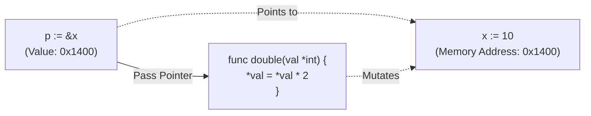

## TL;DR

A **Pointer** holds the memory address of a value, rather than the value itself. By default, Go passes everything by value (making a copy). If you want a function to modify an original variable, or if you want to avoid copying a massive struct, you pass a pointer to it.

## Mental Model



## How It Works

- `&` (Address of operator): Put this in front of a variable to get its pointer (memory address).
- `*` (Dereference operator): Put this in front of a pointer variable to access or modify the actual underlying value.

If you pass a `User` struct to a function, Go creates a brand new `User` struct and copies all the data. If you pass a `*User` (pointer to a User), Go just copies the 8-byte memory address, which is extremely fast, and allows the function to mutate the original user.

## Example

```go
package main

import "fmt"

func passByValue(val int) {
	val = 99 // This modifies the COPY
}

func passByPointer(ptr *int) {
	*ptr = 99 // This modifies the ORIGINAL
}

type Config struct {
    Port int
}

func main() {
	score := 10
	
	passByValue(score)
	fmt.Println("After passByValue:", score) // Still 10!

    // We pass the memory address using &
	passByPointer(&score)
	fmt.Println("After passByPointer:", score) // 99!
	
	// --- POINTERS TO STRUCTS ---
	// Using & creates a pointer to the struct
	cfg := &Config{Port: 8080}
	
	// Unlike C++, Go automatically dereferences pointers for struct fields!
	// You don't need to write (*cfg).Port
	cfg.Port = 9000 
}
```

## Common Interview Questions

### If pointers are faster, should I pass *everything* by pointer?
**No!** This is a huge misconception coming from C/C++. Go has an advanced Garbage Collector and Escape Analysis. If you pass small structs by value, they are allocated on the Stack (which is lightning fast and requires zero garbage collection). If you pass pointers, they often "escape" to the Heap, adding pressure to the Garbage Collector. Only use pointers if you explicitly need to mutate the data, or if the struct is genuinely massive (megabytes in size).

### What is a `nil` pointer dereference?
If a pointer variable is initialized but not assigned to anything, its value is `nil`. If you try to use the `*` operator on a `nil` pointer (or access a field like `cfg.Port` when `cfg` is `nil`), the Go runtime will instantly panic and crash the program. Always check `if ptr != nil` before dereferencing if there is any doubt.
