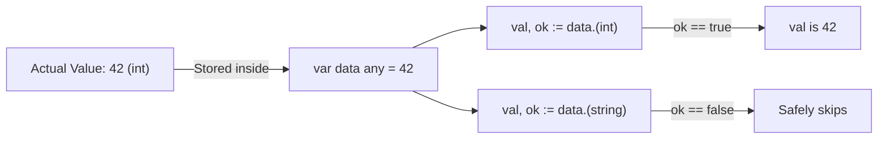

## TL;DR

When you have a variable stored as an interface (especially the empty interface `any`), the compiler loses track of its specific underlying type. A **Type Assertion** allows you to safely check and extract that underlying concrete type so you can access its specific fields or methods.

## Mental Model



## How It Works

An interface value under the hood is a tuple containing two things: `(Type, Value)`.
A type assertion asks the Go runtime: *"Does this interface currently hold an exact type `T`?"*

The syntax is `value.(Type)`.

You should almost always use the "comma ok" idiom: `val, ok := i.(Type)`. 
If you don't use the `ok` boolean and the assertion is wrong, your program will instantly panic and crash!

## Example

```go
package main

import "fmt"

func printLength(data any) {
    // 1. DANGEROUS ASSERTION
    // If 'data' is not a string, this will panic and crash the app!
    // str := data.(string)
    // fmt.Println(len(str))

    // 2. SAFE ASSERTION (Comma Ok idiom)
    str, ok := data.(string)
    if !ok {
        fmt.Println("Warning: Expected a string!")
        return
    }

    // Inside this block, 'str' is safely typed as a string
    fmt.Printf("String length is %d\n", len(str))
}

func main() {
    printLength("Hello World") // Prints 11
    printLength(42)            // Prints "Warning: Expected a string!"
}
```

## Common Interview Questions

### Can a Type Assertion be used to convert types (e.g., int to float64)?
**No.** This is a very common mistake. A type assertion is *not* a type conversion. A type assertion only exposes the exact type that is already hidden inside the interface. If the interface holds an `int`, you cannot assert it to a `float64` (`i.(float64)` will fail). To convert an `int` to a `float64`, you must extract the `int` first, and then perform a standard conversion: `float64(val)`.

### How does Type Assertion differ from Type Switch?
A Type Assertion checks for one specific type. If you need to check if an interface could be one of 5 different types, writing 5 `if val, ok := data.(T)` blocks gets messy. In that case, you should use a **Type Switch**.
