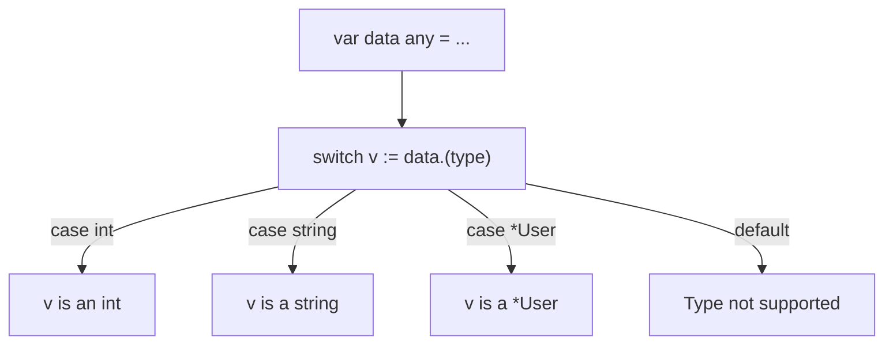

## TL;DR

A **Type Switch** is a clean, readable way to perform multiple type assertions in a row. It evaluates the underlying type of an interface variable and executes the corresponding `case` block, automatically providing the strongly-typed value.

## Mental Model



## How It Works

Instead of checking for a specific type like `data.(string)`, you use the special keyword `type` inside the assertion: `data.(type)`. This syntax is only allowed inside a `switch` statement.

When you assign the result to a variable (`switch v := data.(type)`), the type of `v` automatically changes in each `case` block to match the case.

## Example

```go
package main

import "fmt"

type User struct {
    Name string
}

func processData(data any) {
    // The magic syntax: .(type)
    switch v := data.(type) {
        
    case int:
        // 'v' is typed as an int here
        fmt.Printf("Twice the int: %d\n", v*2)
        
    case string:
        // 'v' is typed as a string here
        fmt.Printf("String length: %d\n", len(v))
        
    case User:
        // 'v' is typed as a User struct here
        fmt.Printf("Found user: %s\n", v.Name)
        
    case bool, float64:
        // If you combine cases, 'v' falls back to 'any'
        fmt.Printf("It's a bool or float: %v\n", v)
        
    default:
        fmt.Printf("Unknown type: %T\n", v)
    }
}

func main() {
    processData(42)
    processData("Hello")
    processData(User{Name: "Alice"})
}
```

## Common Interview Questions

### Can you use a Type Switch on a non-interface variable?
No. Type switches are exclusively for unpacking interfaces (like `any` or a custom interface like `error`). If you have a variable `x := 10`, it is already strongly typed as an `int`. Trying to do a type switch on `x` will result in a compile error.

### How is this useful in error handling?
It is extremely common in Go error handling. If a function returns a generic `error` interface, but you want to check if it was a `NetworkError` or a `ValidationError` (each having custom fields like HTTP status codes), a type switch allows you to route the error handling elegantly. *(Though in modern Go, using `errors.As()` is often preferred).*
