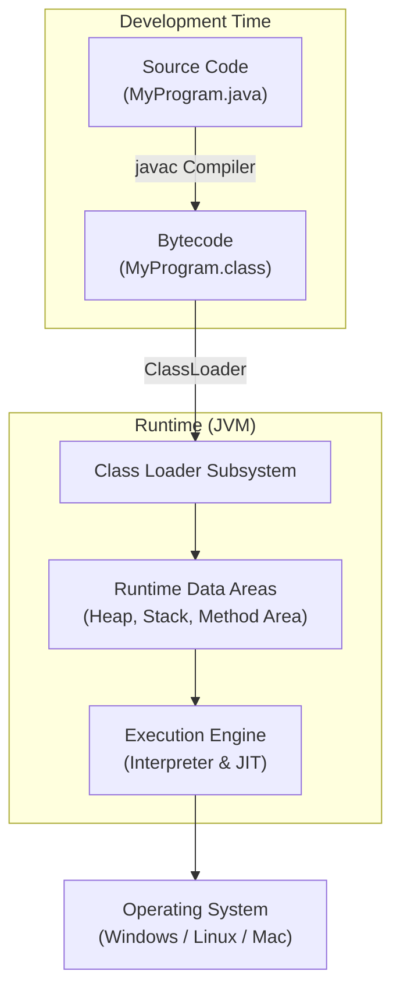

## TL;DR

- **Java Architecture** refers to the ecosystem and process that enables Java's "Write Once, Run Anywhere" (WORA) philosophy.
- It consists of the Java language specifications, the Java API, and the execution engine (JVM).
- Source code (`.java`) is compiled by `javac` into platform-independent Bytecode (`.class`).
- The **Java Virtual Machine (JVM)** translates this Bytecode into machine-specific code at runtime using an interpreter and a Just-In-Time (JIT) compiler.

## Mental Model

## How It Works

### 1. Compilation Phase
Unlike languages like C++ that compile directly to machine code, Java compiles into an intermediate format called **Bytecode**. This bytecode is completely independent of the underlying operating system and hardware architecture.

### 2. Execution Phase
The JVM is the engine that drives the Java code. It performs the following main tasks:
1. **Loads Code**: The Class Loader reads the `.class` files into memory.
2. **Verifies Code**: The Bytecode Verifier ensures the code doesn't violate access rights or cause security breaches.
3. **Executes Code**: The Execution Engine converts the bytecode into native machine code. It uses a combination of an **Interpreter** (which executes instructions line-by-line) and a **Just-In-Time (JIT) Compiler** (which compiles frequently executed "hot" methods into optimized machine code for better performance).

## Interview Questions

Q: What does "Write Once, Run Anywhere" mean?
A: It means that Java source code, once compiled into bytecode, can run on any platform (Windows, Linux, macOS, etc.) without modification, provided that a JVM is installed on that platform. The JVM acts as a translation layer.

Q: Is Java a compiled or interpreted language?
A: Java is **both**. It is first *compiled* into bytecode by the `javac` compiler, and then that bytecode is *interpreted* and (partially) *compiled* at runtime by the JVM's JIT compiler.

Q: Why is the JVM platform-dependent if Java is platform-independent?
A: While the compiled bytecode is platform-independent, the JVM itself must interact directly with the underlying operating system (managing memory, threads, I/O). Therefore, a specific, platform-dependent version of the JVM must be implemented for each operating system (e.g., a Windows JVM, a Linux JVM).
