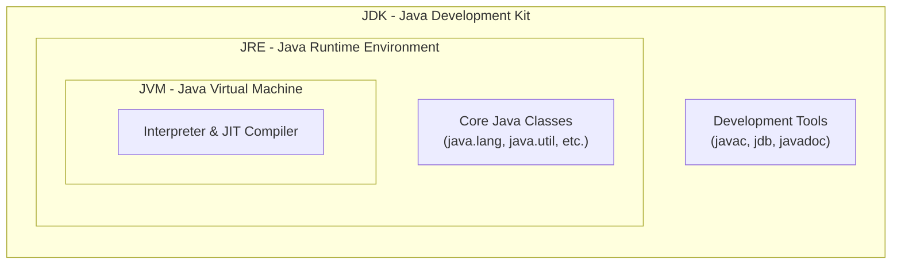

## TL;DR

- **JVM (Java Virtual Machine):** The abstract machine that executes Java Bytecode.
- **JRE (Java Runtime Environment):** JVM + Core Libraries needed to *run* a Java program.
- **JDK (Java Development Kit):** JRE + Development Tools (compiler, debugger, etc.) needed to *develop* a Java program.

## Mental Model

## Concept

### JVM (Java Virtual Machine)
It's the heart of the Java ecosystem. The JVM is a specification (a document describing how it should work), an implementation (like HotSpot), and a runtime instance (the actual process running your code). It converts `.class` files into machine code.

### JRE (Java Runtime Environment)
If you only want to *run* a Java program on your computer, you only need the JRE. It contains the JVM and all the standard class libraries (like `String`, `List`, `Scanner`) that the JVM needs to run the bytecode. 
*Note: Since Java 11, Oracle stopped providing a separate JRE download, pushing users toward custom runtimes via `jlink` or downloading the full JDK.*

### JDK (Java Development Kit)
If you want to *write* Java code, you need the JDK. It includes everything in the JRE, plus essential tools for developers:
- `javac`: The compiler that turns `.java` into `.class`.
- `jdb`: The Java Debugger.
- `javadoc`: Tool to generate documentation.

## Interview Questions

Q: What is the relationship between JDK, JRE, and JVM?
A: The relationship is strictly hierarchical and nested: The JDK contains the JRE, and the JRE contains the JVM. 

Q: If I am just running a Tomcat server in production, do I need a JDK?
A: Traditionally, only a JRE was strictly necessary for production execution. However, some tools (like certain application servers or monitoring agents that compile JSP to Servlets on the fly, or attach debuggers) might require the JDK. Today, many modern deployments simply use a headless JDK or a custom stripped-down runtime created via `jlink`.

Q: Is the JVM written in Java?
A: The JVM specification can be implemented in any language. The most popular implementation, Oracle's HotSpot JVM, is written primarily in C++.
