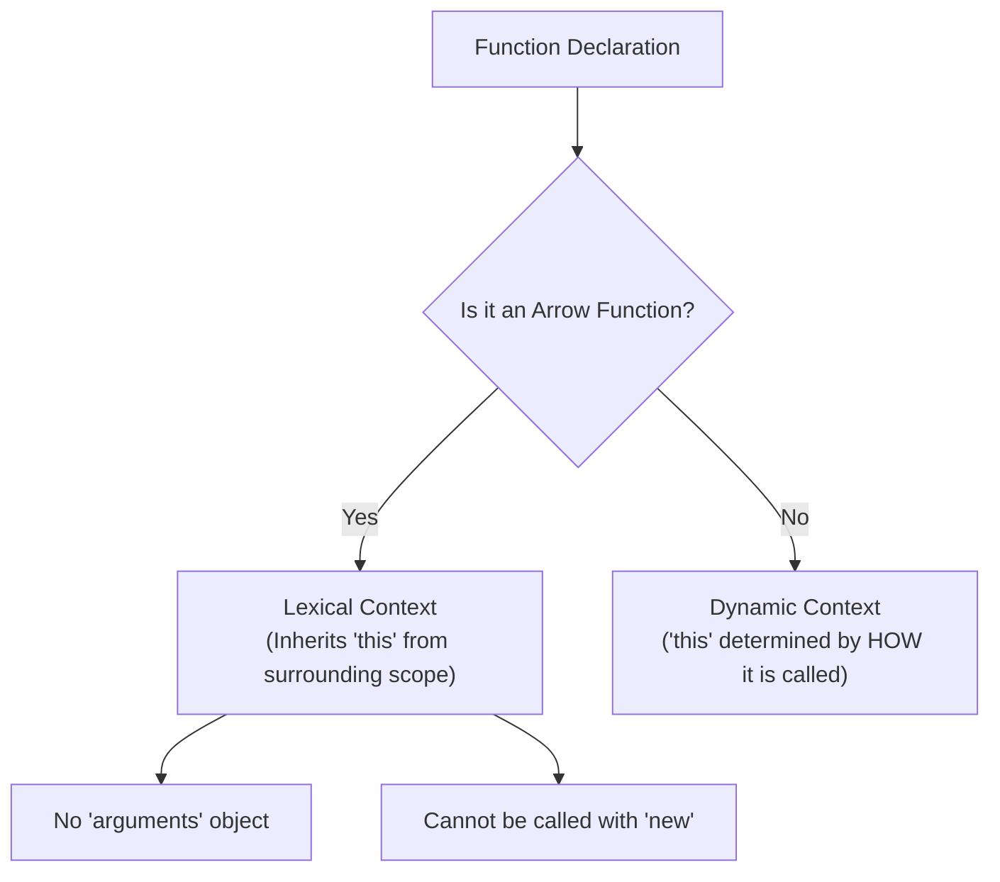

## TL;DR

Arrow functions (`() => {}`) provide a shorter syntax for declaring functions and **lexically bind** the `this` value, meaning they do not have their own `this`, `arguments`, `super`, or `new.target`.

## Mental Model



## Example

```javascript
const user = {
    name: "Alice",
    tasks: ["Task 1", "Task 2"],
    
    // Regular function method
    printTasks: function() {
        // Arrow function inside a regular function
        this.tasks.forEach((task) => {
            // 'this' is inherited from printTasks, so it safely points to 'user'
            console.log(`${this.name} must do ${task}`);
        });
    }
};

user.printTasks();
```

## Differences from Regular Functions

1. **No `this` binding**: Arrow functions inherit `this` from the enclosing lexical context. You never have to do `const self = this;` or `.bind(this)`.
2. **No `arguments` object**: If you need to access passed arguments dynamically, you must use rest parameters (`...args`).
3. **Cannot be used as constructors**: They lack an internal `[[Construct]]` method. Calling `new () => {}` throws a TypeError.
4. **Implicit Return**: If the body is a single expression without braces `{}`, the value is implicitly returned. `const add = (a, b) => a + b;`.

## Interview Questions

### Should you use an arrow function as an object method?
**No**. If you define a method with an arrow function, `this` will NOT point to the object; it will point to the global window (or be undefined in strict mode).
```javascript
const obj = {
    name: "Bob",
    greet: () => console.log(this.name) // BAD! 'this' is the global scope
};
```

### How do you implicitly return an object literal?
Because curly braces `{}` normally denote the function body block, you must wrap the object literal in parenthesis `()` to implicitly return it.
```javascript
const createUser = (name) => ({ id: 1, name: name });
```

## Remember

> Use regular functions for **Object Methods**. Use arrow functions for **Callbacks** (like `.map()`, `.filter()`, `setTimeout`) to preserve `this`.
