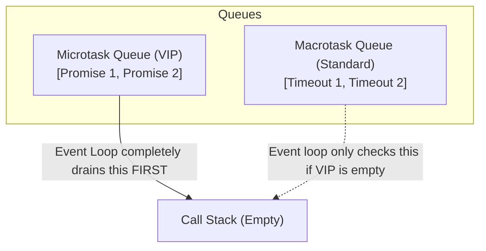

## TL;DR

The Event Loop has two separate queues for asynchronous callbacks. The **Microtask Queue** is the VIP lane, primarily used for Promise resolutions. The **Task Queue** (Macrotask) is the slow lane, used for `setTimeout` and DOM events. The Event Loop will absolutely refuse to process any Macrotasks until the Microtask Queue is 100% empty.

## Mental Model



## How It Works

**What goes in the Microtask Queue?**
- `Promise.then()`, `.catch()`, `.finally()`
- `queueMicrotask()`
- `MutationObserver` (in browsers)
- `process.nextTick()` (in Node.js, though it technically has its own queue that runs *before* standard microtasks).

**What goes in the Macrotask (Task) Queue?**
- `setTimeout()`
- `setInterval()`
- `setImmediate()` (Node.js)
- UI Rendering & DOM Events (Clicks, scrolls)
- I/O operations (Network requests returning)

**The Starvation Problem:**
Because the Event Loop drains the *entire* Microtask queue before checking the Macrotask queue, if a Microtask queues another Microtask, which queues another Microtask infinitely, the Macrotask queue will starve. `setTimeout` callbacks will never run, and the browser UI will completely freeze because it cannot render!

## Example

```javascript
console.log("Start"); // Sync

setTimeout(() => console.log("Timeout 1 (Macro)"), 0);

Promise.resolve().then(() => {
  console.log("Promise 1 (Micro)");
  
  // Queueing a Microtask INSIDE a Microtask
  Promise.resolve().then(() => {
    console.log("Promise 2 (Micro)");
  });
});

console.log("End"); // Sync
```
**Output:**
1. Start
2. End
3. Promise 1 (Micro)
4. Promise 2 (Micro) *(The Event Loop stays in the VIP lane!)*
5. Timeout 1 (Macro)

## Common Output Question

```javascript
setTimeout(() => {
  console.log("A");
  Promise.resolve().then(() => console.log("B"));
}, 0);

setTimeout(() => {
  console.log("C");
}, 0);
```
**Q: What is the exact output order?**
**A:** `A`, `B`, `C`.
Many developers guess `A, C, B`. That is wrong.
1. The first timeout runs, printing `A`.
2. It queues a Promise `B` into the Microtask Queue.
3. **CRITICAL:** Before the Event Loop moves on to the next Macrotask (`C`), it ALWAYS checks the Microtask Queue. 
4. It sees `B` in the Microtask queue, executes it, and prints `B`.
5. Now the Microtask queue is empty again, so it grabs the next Macrotask and prints `C`.

## Senior Interview Question

**Q: Explain the difference between `process.nextTick()` and `setImmediate()` in Node.js.**

**A:** The naming is notoriously terrible and backward. 
- `process.nextTick()` does NOT wait for the "next tick" of the event loop. It executes immediately, *before* the Microtask queue is even checked. It is the absolute highest priority async queue in Node.
- `setImmediate()` does NOT execute immediately. It queues a Macrotask that executes on the *next* iteration of the event loop (specifically in the Check phase).
Therefore, `nextTick` fires before Promises, and `setImmediate` fires after I/O events.
