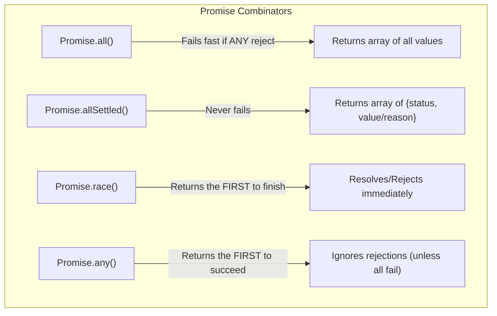

## TL;DR

When you have an array of multiple Promises (e.g., fetching 5 different APIs), you don't want to `await` them one by one. JavaScript provides four built-in **Combinators** to handle multiple promises concurrently: `Promise.all()`, `Promise.allSettled()`, `Promise.race()`, and `Promise.any()`.

## Mental Model



## How It Works

1. **`Promise.all(iterable)`**: 
   - **Use case:** I need ALL this data to proceed.
   - Resolves when ALL promises resolve. Returns an array of results.
   - **Rejects immediately** if even a single promise rejects.

2. **`Promise.allSettled(iterable)`** (ES2020):
   - **Use case:** I want to fetch everything, and I don't care if some fail.
   - Resolves when ALL promises finish (either resolved or rejected).
   - Returns an array of objects: `{ status: 'fulfilled', value: data }` or `{ status: 'rejected', reason: err }`.

3. **`Promise.race(iterable)`**:
   - **Use case:** Implementing a timeout.
   - Resolves or rejects the absolute moment the *first* promise finishes.

4. **`Promise.any(iterable)`** (ES2021):
   - **Use case:** Pinging 3 different servers and using whichever responds first.
   - Resolves when the first promise *resolves*. It completely ignores rejected promises.
   - Only rejects if *all* promises fail (throws an `AggregateError`).

## Example

```javascript
const slowSuccess = new Promise(r => setTimeout(() => r("Slow"), 2000));
const fastReject = new Promise((_, r) => setTimeout(() => r("Failed!"), 500));

// 1. Promise.all -> Will fail at 500ms
Promise.all([slowSuccess, fastReject])
  .then(console.log)
  .catch(err => console.error("All Error:", err)); // Prints "Failed!"

// 2. Promise.allSettled -> Waits 2000ms, returns both
Promise.allSettled([slowSuccess, fastReject])
  .then(results => console.log("Settled:", results));
  // [ { status: 'fulfilled', value: 'Slow' }, 
  //   { status: 'rejected', reason: 'Failed!' } ]

// 3. Promise.race -> Finishes at 500ms
Promise.race([slowSuccess, fastReject])
  .then(console.log)
  .catch(err => console.error("Race Error:", err)); // Prints "Failed!"

// 4. Promise.any -> Finishes at 2000ms! (Ignores the fast rejection)
Promise.any([slowSuccess, fastReject])
  .then(res => console.log("Any Success:", res)) // Prints "Slow"
  .catch(console.error);
```

## Common Output Question

```javascript
const p1 = Promise.resolve(1);
const p2 = Promise.resolve(2);

Promise.all([p1, p2]).then(res => console.log(res));
```
**Q: Does `Promise.all` execute the promises in parallel or sequentially?**
**A:** Neither! `Promise.all` itself does not execute the promises. The promises begin executing the moment they are created (before `Promise.all` is even called). `Promise.all` simply monitors the array of already-running promises and groups their final results together. Since JS is single-threaded, the promises run concurrently via the Event Loop, not in true parallel across multiple CPU cores.

## Senior Interview Question

**Q: How would you implement a timeout for a `fetch` request using Promise combinators?**

**A:** You can use `Promise.race()` to race the `fetch` request against a manual timer promise.

```javascript
function fetchWithTimeout(url, timeoutMs) {
  const fetchPromise = fetch(url);
  
  const timeoutPromise = new Promise((_, reject) => {
    setTimeout(() => reject(new Error("Request Timed Out")), timeoutMs);
  });

  // Whichever finishes first wins the race!
  return Promise.race([fetchPromise, timeoutPromise]);
}

// If fetch takes > 3000ms, the promise rejects.
fetchWithTimeout('/api/data', 3000)
  .then(data => console.log("Success"))
  .catch(err => console.error(err.message)); // "Request Timed Out"
```
