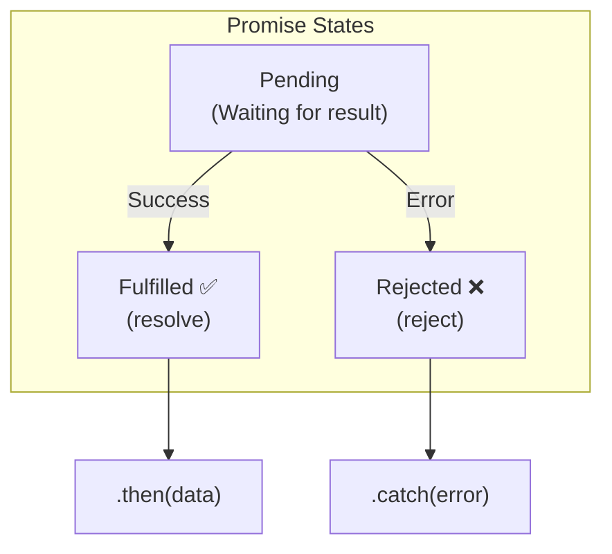

## TL;DR

A **Promise** is an object representing the eventual completion (or failure) of an asynchronous operation. Before Promises, JavaScript relied on nested Callbacks ("Callback Hell") to handle async code. Promises flattened this structure, making code readable and error handling centralized.

## Mental Model



## How It Works

A Promise is always in one of three mutually exclusive states:
1. **Pending**: Initial state. The async operation is still running.
2. **Fulfilled**: The operation completed successfully. `resolve(value)` was called.
3. **Rejected**: The operation failed. `reject(error)` was called.

Once a promise is fulfilled or rejected, it is considered **Settled**. A settled promise is immutable—it cannot change its state or its value ever again.

You consume the result using `.then()` for success and `.catch()` for errors. Because `.then()` always returns a brand *new* Promise, you can chain them together infinitely.

## Example

```javascript
// 1. Creating a Promise
function fetchUser(id) {
  return new Promise((resolve, reject) => {
    // Simulate network delay
    setTimeout(() => {
      if (id === 1) {
        resolve({ id: 1, name: "Alice" }); // Success!
      } else {
        reject("User not found!"); // Failure!
      }
    }, 1000);
  });
}

// 2. Consuming the Promise (Chaining)
fetchUser(1)
  .then((user) => {
    console.log("Success:", user.name);
    return user.id; // This is wrapped in a new Promise automatically!
  })
  .then((id) => {
    console.log("User ID is:", id); // 1
  })
  .catch((error) => {
    // If ANY promise in the chain above rejects, execution jumps straight here.
    console.error("Error:", error);
  })
  .finally(() => {
    // Runs no matter what (good for hiding loading spinners)
    console.log("Fetch attempt finished.");
  });
```

## Common Output Question

```javascript
const p = new Promise((resolve, reject) => {
  console.log("A");
  resolve();
  console.log("B");
});

p.then(() => console.log("C"));

console.log("D");
```
**Q: What is the output order?**
**A:** `A, B, D, C`.
- **Trap:** The executor function passed into `new Promise` runs *synchronously* immediately when the Promise is constructed! So it prints `A`.
- `resolve()` is called. The promise is now Fulfilled.
- It continues executing synchronously and prints `B`.
- `.then()` registers the callback to the Microtask queue.
- `console.log("D")` runs synchronously.
- Stack is empty. Event loop pushes Microtask `C` to the stack.

## Senior Interview Question

**Q: Explain how errors propagate in a Promise chain and what happens if you forget to add a `.catch()` block.**

**A:** If a promise rejects and there is no `.catch()` handler attached directly to it, the rejected state propagates down the chain, skipping all `.then()` blocks until it finds a `.catch()`. 
If it reaches the end of the chain and still hasn't found a `.catch()`, the JavaScript engine throws an `UnhandledPromiseRejectionWarning`. In modern Node.js, an unhandled promise rejection will actually cause the entire Node process to crash with a non-zero exit code, bringing down your server. Therefore, every single promise chain must have a `.catch()`.
