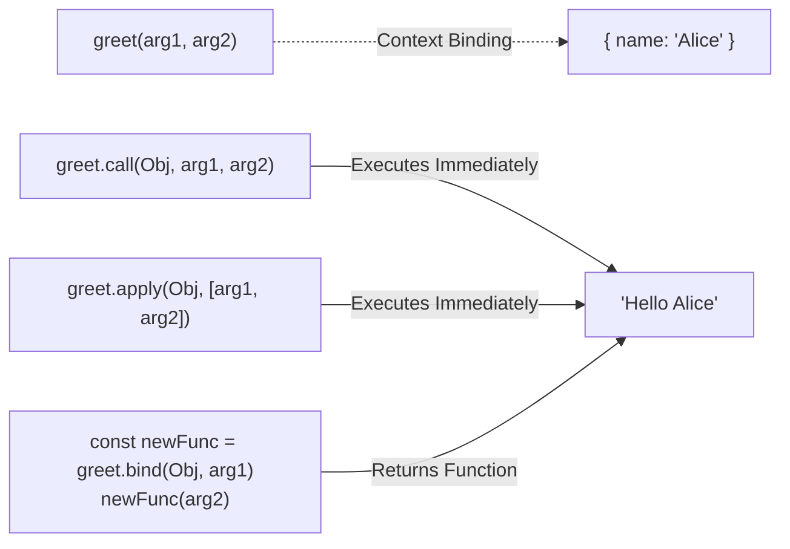

## TL;DR

`call`, `apply`, and `bind` are methods on `Function.prototype` used to manually set the `this` context for a function. 
- **`call`**: Executes immediately, takes arguments separated by commas.
- **`apply`**: Executes immediately, takes arguments as an array.
- **`bind`**: Returns a *new* function with the bound context, executes later.

## Mental Model



## Example

```javascript
const person1 = { name: "Alice" };
const person2 = { name: "Bob" };

function greet(greeting, punctuation) {
    console.log(`${greeting}, ${this.name}${punctuation}`);
}

// 1. call (Comma separated)
greet.call(person1, "Hello", "!"); // "Hello, Alice!"

// 2. apply (Array)
greet.apply(person2, ["Hi", "?"]); // "Hi, Bob?"

// 3. bind (Returns a new function)
const greetAlice = greet.bind(person1, "Welcome");
greetAlice("!!"); // "Welcome, Alice!!"
```

## Interview Questions

### Can you use `call`, `apply`, or `bind` on an Arrow Function?
You can execute them, but they **will not change the `this` context**. Arrow functions permanently inherit `this` from their lexical scope at creation time. The `thisArg` passed to `call`/`apply`/`bind` will be completely ignored.

### How would you borrow a method from an array to use on an array-like object?
You can use `call` to borrow `Array.prototype` methods (like `.slice()`) and use them on objects like `arguments` or DOM `NodeList`s.
```javascript
function listArgs() {
    // arguments is an array-like object, not a real array
    const argsArray = Array.prototype.slice.call(arguments);
    return argsArray;
}
```

## Remember

> **C**all takes **C**ommas. **A**pply takes **A**rrays. **B**ind gives **B**ack a function.
