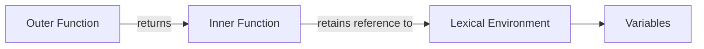

## TL;DR

A closure allows a function to retain access to variables from its lexical scope even after the outer function has returned.

## Mental Model



## Example

```javascript
function createCounter() {
    let count = 0; // Lexical variable

    return function increment() {
        return ++count; // Accesses 'count' from outer scope
    };
}

const counter = createCounter();
console.log(counter()); // 1
console.log(counter()); // 2
```

## How It Works

1. When a function is created, a hidden `[[Environment]]` property is attached to it, pointing to the Lexical Environment where it was created.
2. When the outer function finishes executing, its execution context is popped off the stack.
3. However, because the inner function still holds a reference to the outer environment via `[[Environment]]`, the variables are **not garbage collected**.

## Interview Questions

### What is a closure?
A function bundled together with its lexical environment.

### Why are closures useful?
1. **Data Encapsulation**: Hiding variables from the global scope (e.g., private variables).
2. **Currying and Partial Application**: Creating functions with preset arguments.
3. **Callbacks and Event Handlers**: Preserving state across asynchronous operations.

### What are common problems with closures?
**Memory Leaks**. If a closure retains a large object or DOM element and is never released, that memory cannot be garbage collected.

## Common Gotchas

*   **Loops with `var`**: Using `var` inside a loop with a timeout can cause all closures to reference the final value of the loop variable. Use `let` to fix this because `let` creates a new block scope for each iteration.

## Remember

> A closure is a function + its preserved lexical environment.
