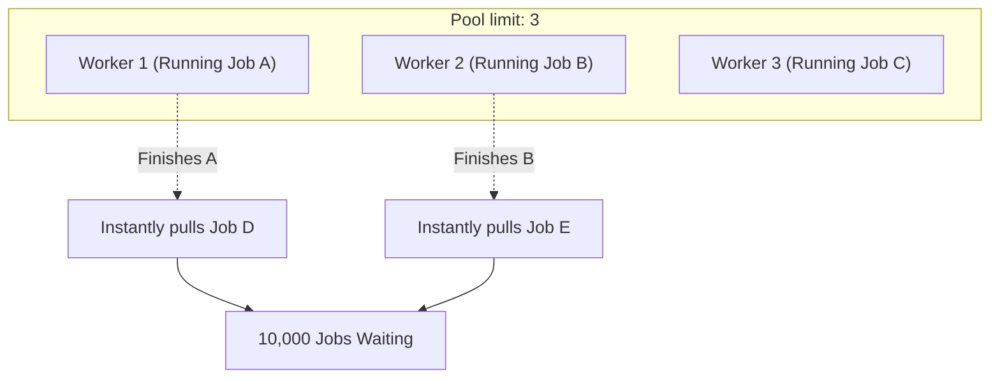

## TL;DR

If you have an array of 10,000 URLs to scrape, using `Promise.all(urls.map(fetch))` will fire 10,000 HTTP requests simultaneously. This will likely crash your Node process (out of memory or file descriptors) or get your IP banned by the target server. A **Concurrency Limiter** (or Promise Pool) ensures that exactly $N$ promises are running at any given time.

## Mental Model



## Why We Need It

It controls resource usage. It provides the perfect middle ground between Sequential processing (too slow) and `Promise.all` (too dangerous).

## Implementation

The cleanest modern implementation uses an asynchronous generator or recursive function. This version uses an async recursive runner.

```javascript
/**
 * @param {Array<Function>} tasks - Array of functions that return Promises
 * @param {number} limit - Maximum number of concurrent tasks
 */
async function promisePool(tasks, limit) {
  const results = [];
  let currentIndex = 0;

  // This is a "worker". It pulls a task from the queue, executes it, 
  // saves the result, and then recursively calls itself to pull the NEXT task.
  async function worker() {
    // Keep working as long as there are tasks left in the queue
    while (currentIndex < tasks.length) {
      // 1. Safely grab the current index and increment it for the next worker
      const taskIndex = currentIndex++;
      
      try {
        // 2. Execute the task and wait for it
        const result = await tasks[taskIndex]();
        results[taskIndex] = result; 
      } catch (error) {
        results[taskIndex] = error; 
      }
    }
  }

  // Create exactly `limit` number of workers and start them all
  const workers = [];
  for (let i = 0; i < limit; i++) {
    workers.push(worker());
  }

  // Wait for all workers to finish emptying the queue
  await Promise.all(workers);

  return results;
}

// --- Usage ---
const createTask = (id, time) => () => 
  new Promise(res => {
    console.log(`Task ${id} Started`);
    setTimeout(() => {
      console.log(`Task ${id} Finished`);
      res(`Result ${id}`);
    }, time);
  });

const tasks = [
  createTask(1, 1000),
  createTask(2, 500),
  createTask(3, 800),
  createTask(4, 200)
];

// Even though there are 4 tasks, only 2 will run at a time!
promisePool(tasks, 2).then(console.log);
```

## Senior Interview Question

**Q: In this implementation, why do the tasks need to be an array of *functions* that return Promises, rather than just an array of Promises?**

**A:** This is a crucial concept in JavaScript. A Promise begins executing the absolute moment it is constructed. If you create an array of 10,000 Promises `[fetch(1), fetch(2), ...]`, all 10,000 network requests have already fired before the array is even passed into the `promisePool` function! The limiter would be useless.
By passing an array of *functions* `[() => fetch(1), () => fetch(2)]`, we delay the creation (and execution) of the Promise. The network request will not fire until the worker actually calls the function `tasks[taskIndex]()`. This guarantees lazy evaluation and true concurrency control.
