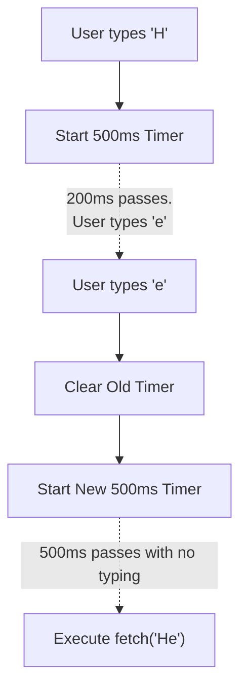

## TL;DR

**Debouncing** ensures that a time-consuming function (like an API call) does not fire repeatedly in quick succession. It forces the function to wait a certain amount of time *after the last event* before executing. If a new event happens before the timer finishes, the timer resets.

## Mental Model



## Why We Need It

Imagine building an Autocomplete search bar. If the user types "apple" very fast (5 keystrokes), you don't want to fire 5 separate API requests (`/search?q=a`, `ap`, `app`, `appl`, `apple`). It will crush your database. You want to wait until they *stop typing* for 300ms, and then fire exactly 1 request for "apple".

## Implementation

The classic FAANG interview requires you to write a Higher-Order Function that accepts a function and a delay, and uses closures to track the timer.

```javascript
function debounce(func, delay) {
  // The closure variable that holds the timer ID
  let timerId;
  
  // Return a new function that the user will actually call
  return function(...args) {
    // 1. If the user calls this function again, immediately cancel the old timer
    clearTimeout(timerId);
    
    // 2. Start a brand new timer
    timerId = setTimeout(() => {
      // 3. When the timer finally completes, execute the original function.
      // Use .apply() to maintain the correct 'this' context and arguments.
      func.apply(this, args);
    }, delay);
  };
}

// --- Usage ---
function fetchResults(query) {
  console.log(`Fetching database for: ${query}`);
}

// We wrap our slow function in the debounce utility
const debouncedSearch = debounce(fetchResults, 300);

// User types "a", "p", "p" rapidly
debouncedSearch("a"); // Timer starts
debouncedSearch("ap"); // Previous timer cancelled, new timer starts
debouncedSearch("app"); // Previous timer cancelled, new timer starts

// 300ms later... Output: "Fetching database for: app"
```

## Senior Interview Question

**Q: In modern React applications, implementing `debounce` directly on an `onChange` handler often fails or causes infinite re-renders. Why does this happen and how do you fix it?**

**A:** If you define `const debouncedSearch = debounce(fetchResults, 300)` directly inside the component body, React will recreate a brand new, distinct instance of the debounced function on every single render. Because each instance has its own separate closure memory, the `clearTimeout` logic fails to cancel the previous timer. 
To fix this, you must wrap the debounce declaration in `useCallback()` (or `useMemo()`) to ensure the exact same function reference (and its closure) is preserved across component re-renders.
