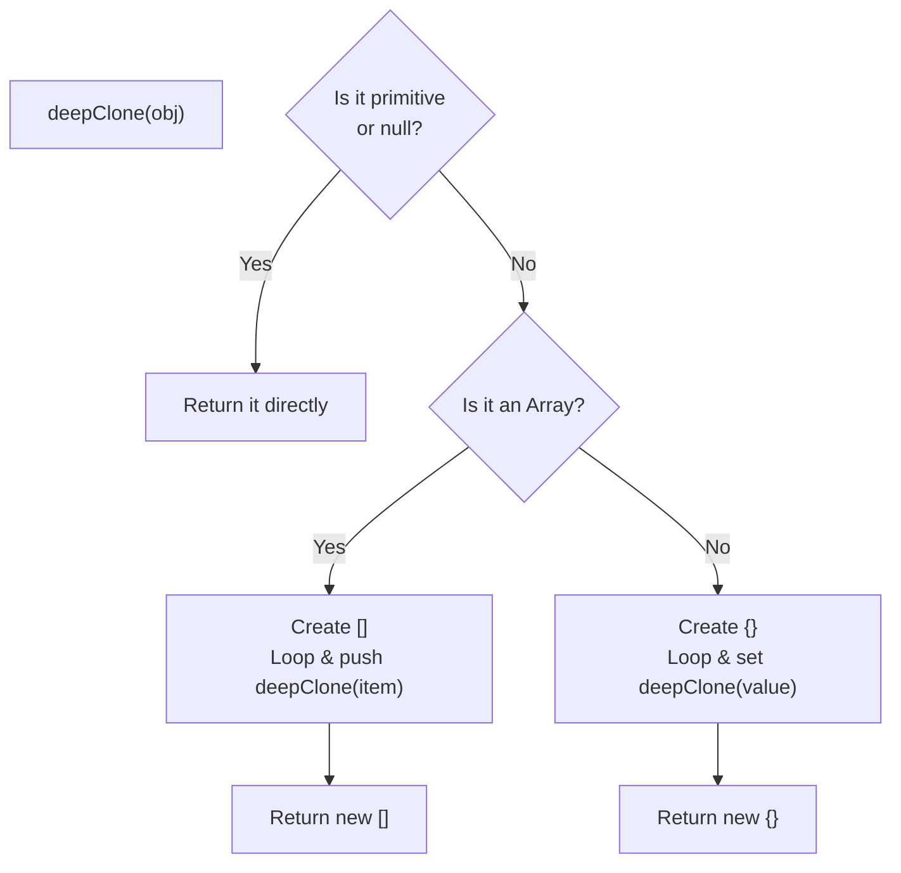

## TL;DR

While `structuredClone()` exists in modern JS, interviewers frequently ask you to implement `deepClone()` from scratch. It tests your knowledge of **Recursion**, **Type Checking** (Arrays vs Objects), and handling Edge Cases (like `null`).

## Mental Model



## Why We Need It

If you simply use `{ ...obj }` (Spread operator) or `Object.assign({}, obj)`, you only perform a **Shallow Copy**. If your object contains nested objects or arrays, the copy will just point to the exact same memory locations as the original nested objects. Modifying the copy will mutate the original. Deep Clone guarantees 100% memory isolation.

## Implementation

A robust implementation must handle Primitives, Arrays, and Objects.

```javascript
function deepClone(value) {
  // 1. Handle Primitives and null
  // (typeof null is "object", so we must explicitly check for it)
  if (value === null || typeof value !== "object") {
    return value;
  }

  // 2. Handle Arrays
  if (Array.isArray(value)) {
    const arrCopy = [];
    for (let i = 0; i < value.length; i++) {
      // Recursively clone every item in the array
      arrCopy.push(deepClone(value[i])); 
    }
    return arrCopy;
  }

  // 3. Handle Standard Objects
  const objCopy = {};
  for (const key in value) {
    // Ensure we don't clone properties from the prototype chain
    if (value.hasOwnProperty(key)) {
      // Recursively clone every value in the object
      objCopy[key] = deepClone(value[key]);
    }
  }

  return objCopy;
}

// --- Usage ---
const original = {
  name: "Alice",
  hobbies: ["reading", "gaming"],
  settings: { theme: "dark" }
};

const copy = deepClone(original);

// Mutating the copy safely
copy.hobbies.push("coding");
copy.settings.theme = "light";

console.log(original.hobbies.length); // 2 (Unaffected!)
console.log(original.settings.theme); // "dark" (Unaffected!)
```

## Senior Interview Question

**Q: How would you modify your `deepClone` implementation to handle Circular References without crashing?**

**A:** A Circular Reference occurs when an object has a property that points back to itself (`obj.self = obj`). If you pass this to our basic `deepClone`, the recursion will loop infinitely and cause a Stack Overflow. 
To fix this, we must maintain a memory (a `WeakMap`) of every object we have already cloned. Before cloning an object, we check the `WeakMap`. If it exists, we immediately return the cached clone instead of recursing.
```javascript
function deepClone(value, hash = new WeakMap()) {
  if (value === null || typeof value !== "object") return value;
  
  // If we already cloned this exact memory reference, return the clone!
  if (hash.has(value)) return hash.get(value); 

  const result = Array.isArray(value) ? [] : {};
  hash.set(value, result); // Remember this object BEFORE recursing

  for (const key in value) {
    if (value.hasOwnProperty(key)) {
      result[key] = deepClone(value[key], hash); // Pass the map down
    }
  }
  return result;
}
```
