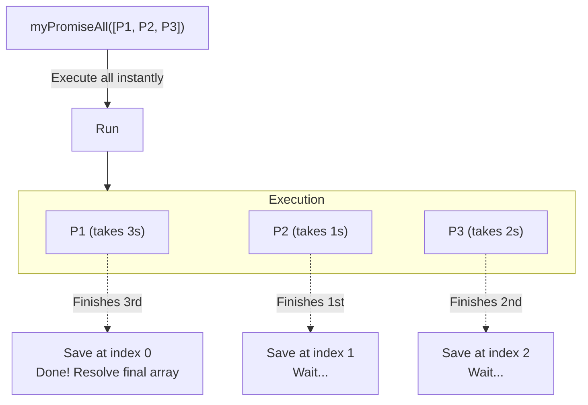

## TL;DR

Implementing `Promise.all()` from scratch is one of the most common asynchronous coding questions. It tests your understanding of Promises, parallel execution, and maintaining array ordering based on indexes rather than execution speed.

## Mental Model



## Why We Need It

The requirement for `Promise.all` is strict:
1. It must return a new Promise.
2. It must resolve with an array of values in the *exact same order* as the input array, regardless of which promise finished first.
3. If *any* single promise rejects, the entire returned promise must reject instantly.

## Implementation

```javascript
function myPromiseAll(promises) {
  // 1. It must return a new Promise
  return new Promise((resolve, reject) => {
    
    // Edge case: Empty array
    if (promises.length === 0) {
      resolve([]);
      return;
    }

    const results = [];
    let completedCount = 0;

    // 2. Loop through all promises to start them concurrently
    for (let i = 0; i < promises.length; i++) {
      
      // We wrap it in Promise.resolve() just in case the user 
      // passed a normal value (like '5') instead of a Promise object
      Promise.resolve(promises[i])
        .then(value => {
          // 3. Store the result at the EXACT same index it was passed in
          results[i] = value;
          completedCount++;

          // 4. Only resolve the main promise when ALL have finished
          if (completedCount === promises.length) {
            resolve(results);
          }
        })
        .catch(error => {
          // 5. If any promise fails, instantly reject the main promise
          reject(error);
        });
    }
  });
}

// --- Usage ---
const p1 = new Promise(r => setTimeout(() => r("Slow"), 1000));
const p2 = Promise.resolve("Fast");
const p3 = 42; // Testing non-promise values

myPromiseAll([p1, p2, p3]).then(console.log);
// Output after 1s: ["Slow", "Fast", 42]
```

## Senior Interview Question

**Q: In your implementation, why did you use `results[i] = value` instead of `results.push(value)`?**

**A:** If we used `results.push(value)`, the final array would be ordered by *execution speed*. In the example, `p2` finishes instantly, so it would be pushed first. `p1` finishes after 1 second, so it would be pushed second. The output array would be `["Fast", 42, "Slow"]`, which breaks the contract of `Promise.all`. 
By using `results[i] = value`, we use the closure over the block-scoped `let i` from the `for` loop to guarantee that `p1`'s result is forced into index 0, even if it finishes last.
