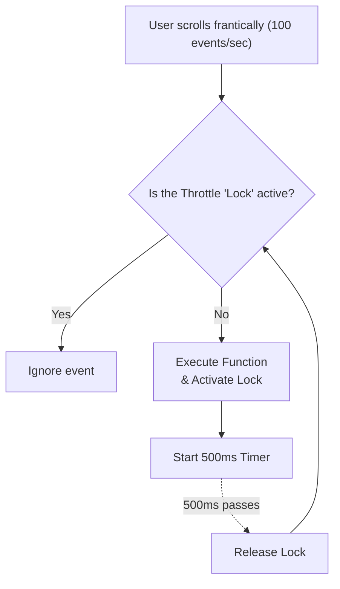

## TL;DR

**Throttling** guarantees that a function will execute at a regular interval, no matter how many times it is triggered. While Debounce waits for the user to *stop* acting, Throttle forces the action to happen *steadily* (e.g., exactly once every 500ms) while the user is acting.

## Mental Model



## Why We Need It

Imagine listening to a `window.onscroll` event to calculate an animation. A single scroll of the mouse wheel can fire the event 50 times in half a second. If your animation calculation is heavy, the browser will freeze. Throttling ensures the calculation only runs, for example, once every 100ms, keeping the animation smooth.

## Implementation

The standard interview implementation uses a boolean flag (the "lock" or "throttle valve") to ignore calls until a `setTimeout` releases the flag.

```javascript
function throttle(func, limit) {
  // The closure variable that tracks the lock state
  let inThrottle = false;
  
  return function(...args) {
    // 1. If we are currently throttled, do absolutely nothing (ignore the call)
    if (!inThrottle) {
      // 2. If the lock is open, execute the function immediately
      func.apply(this, args);
      
      // 3. Immediately close the lock so subsequent calls are ignored
      inThrottle = true;
      
      // 4. Set a timer to open the lock after 'limit' milliseconds
      setTimeout(() => {
        inThrottle = false;
      }, limit);
    }
  };
}

// --- Usage ---
function handleScroll() {
  console.log("Calculating heavy scroll animation...");
}

const throttledScroll = throttle(handleScroll, 1000);

// Simulate the user scrolling 3 times in quick succession
throttledScroll(); // Executes instantly, lock is set!
throttledScroll(); // Ignored (lock is active)
throttledScroll(); // Ignored (lock is active)

// 1000ms later, the lock is released. 
// If the user scrolls again, it will execute once more.
```

## Senior Interview Question

**Q: Explain the difference between Debounce and Throttle, and when you would use each.**

**A:** 
- **Debounce** groups multiple rapid events into a single execution at the very *end* of the activity. It is perfect for **Search Autocomplete** or saving a form after the user stops typing. The user must pause for the action to happen.
- **Throttle** guarantees a steady execution rate *during* the activity. It is perfect for **Window Resizing, Scrolling, or Shooting a gun in a video game**. You want the action to happen consistently while the user is holding down the button or scrolling the mouse, without locking up the CPU.
