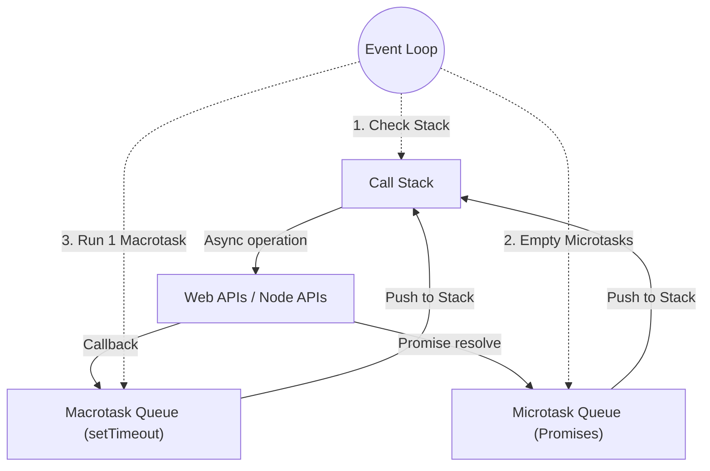

## TL;DR

The Event Loop is a mechanism that allows JavaScript to perform non-blocking operations by offloading tasks to the browser (Web APIs) and pushing their callbacks back to the Call Stack when they are ready and the stack is empty.

## Mental Model



## Example

```javascript
console.log("1. Start");

setTimeout(() => {
    console.log("4. Timeout (Macrotask)");
}, 0);

Promise.resolve().then(() => {
    console.log("3. Promise (Microtask)");
});

console.log("2. End");
```

**Output:**
1. Start
2. End
3. Promise (Microtask)
4. Timeout (Macrotask)

## How It Works

1. **Call Stack**: Executes synchronous code block by block.
2. **Web APIs**: When an async function like `setTimeout` or `fetch` is called, it is pushed to the Web APIs (or C++ APIs in Node) to handle the background work.
3. **Queues**:
   - **Microtask Queue**: Holds callbacks from `Promises`, `MutationObserver`, and `queueMicrotask`.
   - **Macrotask (Task) Queue**: Holds callbacks from `setTimeout`, `setInterval`, I/O, and UI rendering.
4. **The Loop**: 
   - Wait until the Call Stack is completely empty.
   - Execute **ALL** Microtasks until the Microtask Queue is completely empty (even if they queue more Microtasks).
   - Execute exactly **ONE** Macrotask.
   - Repeat.

## Interview Questions

### What happens if you recursively queue Microtasks?
Because the Event Loop processes *all* microtasks before moving on, an infinite loop of microtasks will **block the event loop**, freezing the UI or server. 

```javascript
// This will freeze the browser!
function infiniteMicrotask() {
    Promise.resolve().then(infiniteMicrotask);
}
```

### Why does `setTimeout(fn, 0)` not execute immediately?
`0` specifies the minimum delay before the callback is added to the Macrotask Queue. It still must wait for the Call Stack and Microtask Queue to be empty, and for any preceding Macrotasks to finish.

## Common Gotchas

*   **Async/Await**: Code after an `await` acts like a Promise `.then()` block, meaning it gets placed on the Microtask Queue.

## Remember

> Microtasks have VIP access. The Event Loop won't do *anything* else until the Microtask Queue is completely empty.
