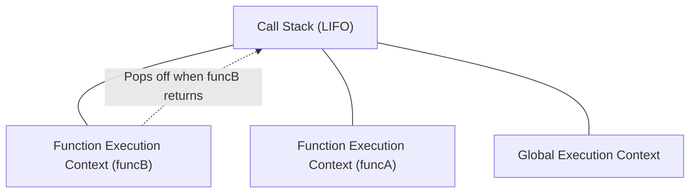

## TL;DR

Every time JavaScript code runs, it runs inside an **Execution Context**. The engine uses a **Call Stack** (LIFO) to keep track of these contexts, ensuring functions are executed in the correct order.

## Mental Model



## Example

```javascript
let name = "Alice"; // Global Context

function funcA() {
    console.log("Entering funcA");
    funcB(); // Creates new context and pushes to stack
    console.log("Exiting funcA");
}

function funcB() {
    console.log("Inside funcB");
}

funcA();
// Output:
// Entering funcA
// Inside funcB
// Exiting funcA
```

## How It Works

An Execution Context is created in two phases:
1. **Creation Phase**:
   - The Global Object (`window` in browser) and `this` are created.
   - Memory is allocated for variables and functions (**Hoisting**). Variables are initialized to `undefined` (if `var`), and functions are fully stored.
2. **Execution Phase**:
   - Code is executed line by line. Variables are assigned their actual values.

When a function is called, a **Function Execution Context** is created and pushed to the top of the Call Stack. When the function returns, its context is popped off the stack.

## Interview Questions

### What happens if the Call Stack gets too large?
You get a **Stack Overflow** error (`Maximum call stack size exceeded`). This usually happens when a recursive function lacks a proper base case.

### Does the Global Execution Context ever get popped off the stack?
No, it remains at the bottom of the Call Stack until the program terminates (e.g., you close the browser tab or the Node.js process exits).

## Common Gotchas

*   **Lexical Environment**: Each Execution Context has a reference to its outer (lexical) environment. This is how the engine resolves variables not found in the local scope (the **Scope Chain**), which forms the basis for Closures.

## Remember

> The Call Stack handles *synchronous* code block by block. To handle *asynchronous* code without blocking the stack, JS relies on the Event Loop.
