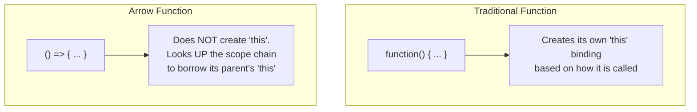

## TL;DR

Introduced in ES6, **Arrow Functions** (`() => {}`) provide a more concise syntax for writing function expressions. More importantly, they do not have their own `this` or `arguments` binding; they inherit them from their parent scope (Lexical `this`).

## Mental Model



## How It Works

**1. Syntax Sugar:**
- If there is only one parameter, parentheses are optional: `x => x * 2`.
- If there is only one line of code, the `return` keyword and curly braces `{}` are optional (Implicit Return).

**2. Lexical `this`:**
Traditional functions determine `this` dynamically based on who called them. Arrow functions resolve `this` statically based on where they are written in the code. They behave just like normal variables looking up the Scope Chain.

**3. Limitations:**
- Cannot be used as constructors (`new Arrow() ` throws an error).
- Do not have the `arguments` object (use rest parameters `...args` instead).
- Cannot be used as Generator functions (`yield` is forbidden).

## Example

```javascript
// --- Syntax ---
const add = (a, b) => a + b; // Implicit return
const greet = name => `Hello ${name}`; // No parenthesis for 1 arg

// --- Lexical this ---
const user = {
  name: "Alice",
  // A traditional function binds 'this' to the object calling it
  sayHiNormal: function() {
    setTimeout(function() {
      // Bug! Inside a traditional callback, 'this' defaults to window
      console.log(`Hi, I am ${this.name}`); 
    }, 100);
  },
  
  // Arrow functions fix this!
  sayHiArrow: function() {
    setTimeout(() => {
      // The arrow function looks up to 'sayHiArrow' to find 'this'
      console.log(`Hi, I am ${this.name}`); 
    }, 100);
  }
};

user.sayHiNormal(); // "Hi, I am undefined"
user.sayHiArrow();  // "Hi, I am Alice"
```

## Common Output Question

```javascript
const obj = {
  id: 42,
  printId: () => {
    console.log(this.id);
  }
};

obj.printId();
```
**Q: What does this output and why?**
**A:** `undefined`. 
It is a massive anti-pattern to use an arrow function as an object method. The arrow function looks up the scope chain for `this`. Object literals `{}` do not create a scope. So it looks past the object directly to the Global Scope (`window`), where `this.id` does not exist. 

## Senior Interview Question

**Q: Can you change the `this` binding of an arrow function using `.bind()`, `.call()`, or `.apply()`?**

**A:** **No.** The lexical binding of `this` in an arrow function is permanent and irreversible. If you try to do `arrowFunc.call({name: "Bob"})`, JavaScript will completely ignore the `call` context and continue using the original lexical `this`.
