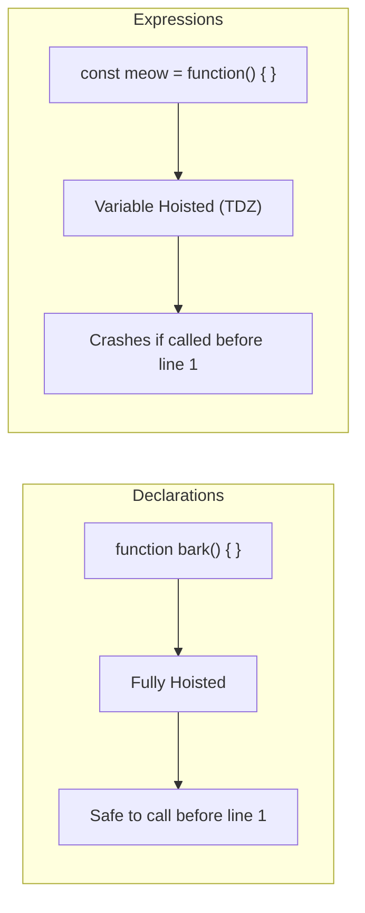

## TL;DR

- **Function Declaration**: Starts with the `function` keyword as a standalone statement. It is fully hoisted to the top of its scope.
- **Function Expression**: The function is assigned to a variable (`const myFunc = function() {}`). It behaves like a variable, meaning it is NOT hoisted (if using `let`/`const`) and cannot be called before it is defined.

## Mental Model



## How It Works

**Function Declarations** are processed by the JavaScript engine before any code executes. The engine literally lifts the entire function definition to the top of the current scope. This allows you to structure your files with the main execution logic at the top, and utility functions pushed down to the bottom.

**Function Expressions** wait for the execution phase. The variable name (`meow`) is hoisted, but the actual function logic is not assigned until the engine reaches that specific line of code.

## Example

```javascript
// --- Function Declaration ---
// This works perfectly because setupApp is fully hoisted.
setupApp(); 

function setupApp() {
    console.log("App is ready!");
}

// --- Function Expression ---
// This crashes! ReferenceError: Cannot access 'loadData' before initialization
// loadData(); 

const loadData = function() {
    console.log("Loading...");
};

// Now it works:
loadData();
```

## Common Output Question

```javascript
var run = function() {
  console.log("Run 1");
};

function run() {
  console.log("Run 2");
}

run();
```
**Q: What does this output and why?**
**A:** `"Run 1"`. 
During the Creation Phase, the `function run()` declaration is hoisted first. Then, the `var run` variable is hoisted. During the Execution Phase, the assignment `run = function() { console.log("Run 1") }` occurs, completely overwriting the original function declaration in memory. When `run()` is finally called, it holds the expression's logic.

## Senior Interview Question

**Q: Are Function Expressions anonymous?**

**A:** They usually are (e.g., `const fn = function() {}`), but they don't have to be! You can create a **Named Function Expression**:
`const math = function factorial(n) { ... }`.
The key detail here is that the name `factorial` is *not* added to the outer scope. It is only accessible *inside* the function itself. This is incredibly useful for writing recursive functions or ensuring the function shows up with a proper name in stack traces during debugging, rather than just showing as `(anonymous)`.
