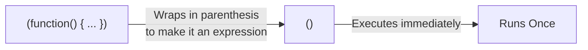

## TL;DR

An **IIFE** (pronounced "iffy") is a JavaScript function that runs as soon as it is defined. Historically, it was the primary way to create private variables and block scope before `let`, `const`, and ES6 Modules existed.

## Mental Model



## How It Works

If you just write `function() {}`, JavaScript throws a Syntax Error because it expects a Function Declaration with a name. 
By wrapping the function in parentheses `(function() {})`, you trick the JavaScript parser into treating it as a **Function Expression**. 
Then, you add `()` at the very end to immediately invoke that expression.

Because functions create their own Scope, any variables declared inside the IIFE with `var` are trapped inside it. They cannot leak out and pollute the Global Scope.

## Example

```javascript
// The classic IIFE pattern
(function() {
  var privateSecret = "I am hidden";
  console.log("I run immediately!");
})();

// console.log(privateSecret); // ReferenceError! It is completely private.

// IIFE with arguments
(function(name) {
  console.log(`Hello, ${name}!`);
})("Alice");
```

## Common Output Question

```javascript
for (var i = 0; i < 3; i++) {
  setTimeout(function() {
    console.log(i);
  }, 100);
}
```
**Q: The code above prints `3 3 3`. How did developers fix this BEFORE `let` was invented?**
**A:** By using an IIFE to capture the value of `i` in a closure!
```javascript
for (var i = 0; i < 3; i++) {
  (function(capturedIndex) {
    setTimeout(function() {
      console.log(capturedIndex);
    }, 100);
  })(i);
}
// Prints 0 1 2!
```
The IIFE executes immediately on each loop iteration, receiving the current value of `i` and storing it as `capturedIndex` in its own private function scope.

## Senior Interview Question

**Q: Do we still need IIFEs in modern ES6+ JavaScript?**

**A:** Mostly no, but they still have a few niche uses.
1. **Data Privacy:** We now use `let` and `const` inside standard block scopes `{}` to prevent global pollution, or ES6 Modules which have their own file-level scope.
2. **Top-Level Await:** We used to use IIFEs to run `async` code at the top of a file because `await` only worked inside async functions: `(async () => { await fetch(...) })()`. However, modern ES Modules now support Top-Level Await, making even this use-case obsolete.
They are now primarily an interview topic to test historical JS knowledge.
