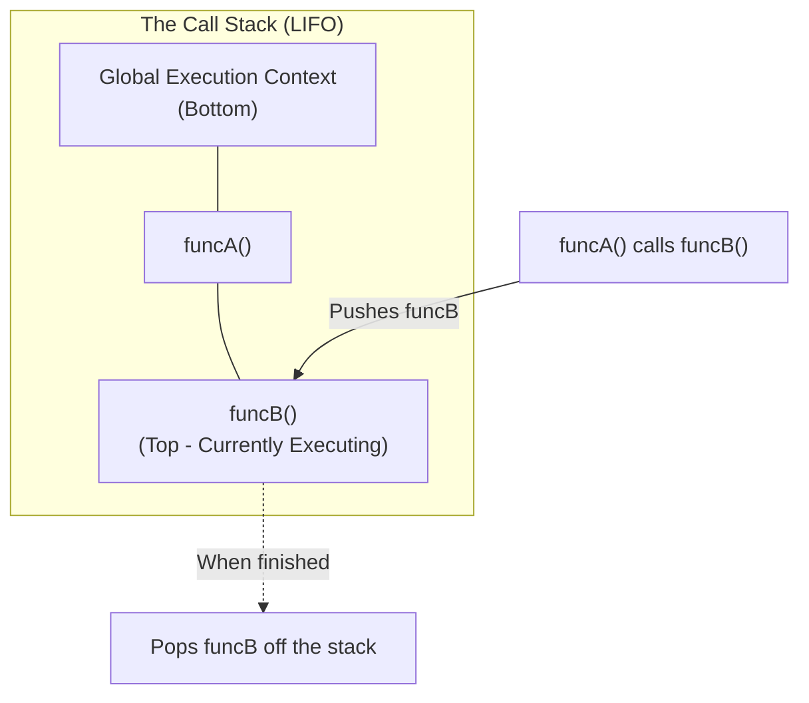

## TL;DR

The **Call Stack** is a fundamental data structure in the JavaScript engine (like V8). It uses a Last-In, First-Out (LIFO) principle to track exactly where the engine is in a script that calls multiple functions. When a function is called, it's pushed onto the stack. When it finishes, it's popped off.

## Mental Model



## How It Works

JavaScript is strictly **single-threaded**, meaning it has exactly one Call Stack and can only execute one piece of code at a time. 

1. When a script runs, the engine creates a Global Execution Context and pushes it to the stack.
2. Whenever a function is invoked, the engine creates a new Execution Context for that function and pushes it onto the top of the stack.
3. The engine executes the function at the top of the stack.
4. If that function calls another function, the new function is pushed to the top.
5. Once a function returns a value (or hits the end of its block), it is popped off the stack, and execution resumes where it left off in the function below it.

## Example

```javascript
function greet() {
  console.log("Hello!"); // 2. Pushed to stack, executed, popped
}

function startApp() {
  greet(); // 1. Pushed to stack, calls greet()
  console.log("App Started"); // 3. Executed after greet() finishes
}

startApp(); 
```

**Step-by-Step Stack:**
1. `startApp()` is invoked. Stack: `[startApp]`
2. `greet()` is invoked. Stack: `[startApp, greet]`
3. `console.log("Hello!")` runs. Stack: `[startApp, greet, log]`
4. `log` finishes. Stack: `[startApp, greet]`
5. `greet` finishes. Stack: `[startApp]`
6. `console.log("App Started")` runs. Stack: `[startApp, log]`
7. `log` finishes. Stack: `[startApp]`
8. `startApp` finishes. Stack: `[]` (Empty)

## Common Output Question

```javascript
function recursive() {
  recursive();
}
recursive();
```
**Q: What happens when this code is executed?**
**A:** It causes a **Stack Overflow** (specifically, `RangeError: Maximum call stack size exceeded`). Because the function calls itself without an exit condition, it keeps pushing frames onto the stack until the browser/Node runs out of memory allocated for the stack.

## Senior Interview Question

**Q: If JavaScript has only one Call Stack and executes sequentially, how does it handle asynchronous operations like `fetch()` or `setTimeout` without freezing the entire browser?**

**A:** The Call Stack relies on the **Web APIs** (or C++ APIs in Node) and the **Event Loop**. When `setTimeout` is called, the Call Stack instantly pops it off and hands the timer responsibility to the Browser's Web API. The Call Stack continues executing the next line of synchronous code perfectly unblocked. Once the Web API finishes the timer, it pushes the callback function into the Task Queue. The Event Loop waits until the Call Stack is completely empty, and then pushes the callback from the Task Queue onto the Call Stack for execution.
