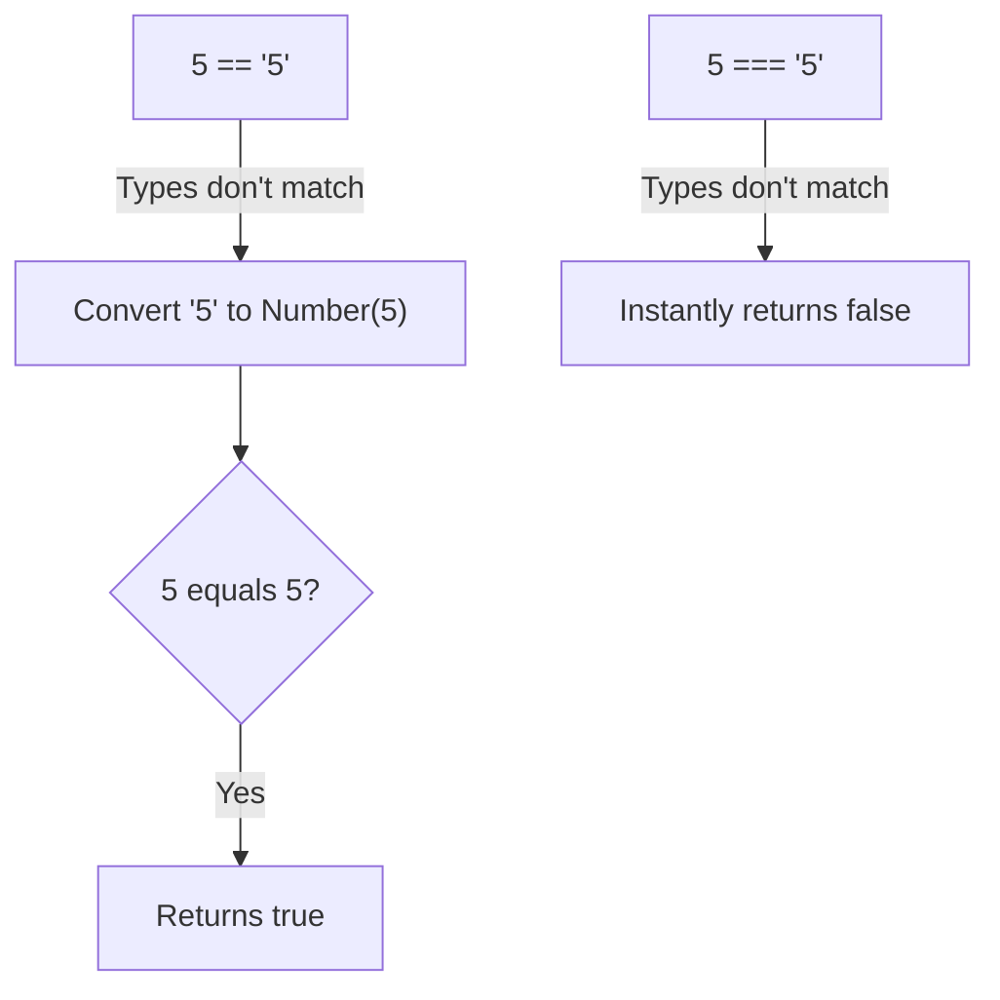

## TL;DR

- `===` (Strict Equality): Checks if the **value** AND the **type** are identical.
- `==` (Loose Equality): Attempts to convert the types to match before comparing the values (Type Coercion).

**Always use `===`** in modern JavaScript to avoid massive logical bugs.

## Mental Model



## How It Works

When you use `==`, JavaScript follows a complex set of rules called the **Abstract Equality Comparison Algorithm**.
If the types differ, it tries to convert them to numbers:
- `"5" == 5` -> Converts `"5"` to `5` -> `5 == 5` (true)
- `true == 1` -> Converts `true` to `1` -> `1 == 1` (true)
- `[] == false` -> Converts `[]` to `""`, then to `0`. Converts `false` to `0` -> `0 == 0` (true!)

When you use `===`, JavaScript performs the **Strict Equality Comparison**. If the `typeof` the two operands is different, it immediately returns `false`. No conversion happens.

## Example

```javascript
// Loose Equality (==) - Chaos
console.log(1 == "1");      // true
console.log(0 == false);    // true
console.log([] == "");      // true
console.log([] == 0);       // true
console.log([1,2] == "1,2"); // true! Arrays are coerced to strings.

// Strict Equality (===) - Sanity
console.log(1 === "1");     // false (number vs string)
console.log(0 === false);   // false (number vs boolean)
console.log([] === "");     // false (object vs string)
```

## Common Output Question

```javascript
console.log(null == undefined);
console.log(null === undefined);
console.log(NaN === NaN);
```
**Q: What does this output?**
**A:**
1. `true`: The ECMAScript spec specifically hardcodes `null` and `undefined` to loosely equal each other.
2. `false`: They are of different types (`object` vs `undefined`).
3. `false`: `NaN` is incredibly unique. It is the only value in JavaScript that is not strictly equal to itself. You must use `Number.isNaN()` or `Object.is(NaN, NaN)` to check for it.

## Senior Interview Question

**Q: Are there any valid use cases for using `==` in modern JavaScript?**

**A:** The only widely accepted use case for loose equality is checking for the absence of a value. 
Writing `if (value == null)` is a shorthand trick that returns `true` if `value` is EITHER `null` OR `undefined`, because of how they loosely equate to each other. This saves you from writing `if (value === null || value === undefined)`. Outside of this single pattern, `==` should be strictly forbidden by linters (like ESLint's `eqeqeq` rule).
