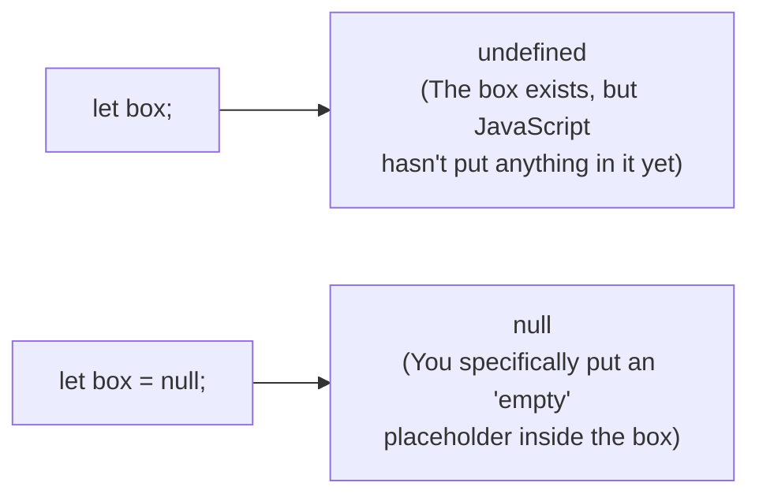

## TL;DR

- **`undefined`**: Means a variable has been declared but has not yet been assigned a value. It's JavaScript's default "empty" state.
- **`null`**: Means "nothing" or "empty". It is explicitly assigned by the developer to indicate that a variable intentionally holds no value.

## Mental Model



## How It Works

**`undefined`** is assigned by the JavaScript engine in many scenarios:
- A declared variable with no value (`let x;`).
- A function that doesn't explicitly return anything.
- Accessing an object property that doesn't exist (`user.fakeProperty`).
- Accessing an array index out of bounds (`arr[99]`).

**`null`** is never automatically assigned by JavaScript. You must type `= null`. It is often used to clear a variable's contents for Garbage Collection, or as a default starting state for an object that will be fetched later.

**The `typeof` Bug:**
- `typeof undefined` is `"undefined"`.
- `typeof null` is `"object"`. (This is a famous bug from the very first version of JavaScript, but fixing it would break the internet, so it remains forever).

## Example

```javascript
// --- undefined ---
let username;
console.log(username); // undefined (System set)

function doNothing() {}
console.log(doNothing()); // undefined (Implicit return)

const user = { name: "Alice" };
console.log(user.age); // undefined (Property doesn't exist)

// --- null ---
let activeUser = null; // Explicitly stating there is no active user yet
console.log(activeUser); // null
```

## Common Output Question

```javascript
console.log(Number(null));
console.log(Number(undefined));
```
**Q: What does this output and why?**
**A:**
`0`
`NaN`
When doing math, JavaScript coerces `null` into `0`. However, `undefined` is converted into `NaN` (Not a Number). This makes `undefined` slightly more dangerous in math operations because `NaN` poisons any subsequent calculations.

## Senior Interview Question

**Q: How do you safely check if an object property exists without triggering a false positive if the property is explicitly set to `undefined`?**

**A:** If you use a simple truthy check `if (user.age)`, it fails if `age` is `0`, `""`, or `undefined`.
If you use `if (user.age !== undefined)`, it fails if the developer explicitly set `user.age = undefined`.
To truly check if the *key* exists on the object, regardless of its value, you must use the `in` operator or `hasOwnProperty`:
`if ("age" in user)` or `if (Object.hasOwn(user, "age"))`.
