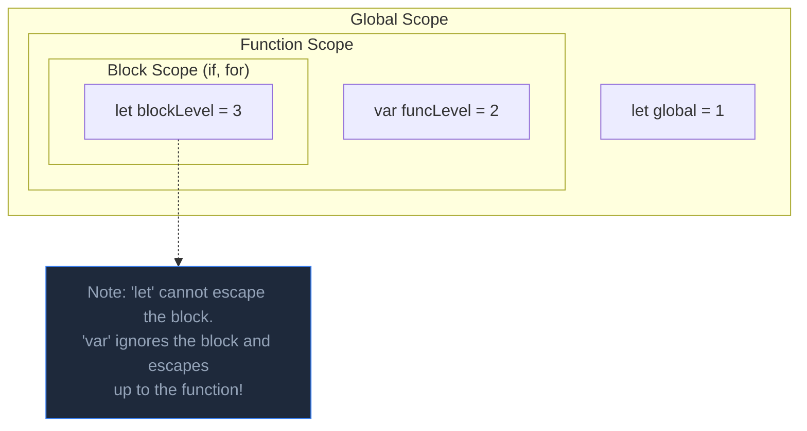

## TL;DR

**Scope** determines the visibility and accessibility of variables in your code. JavaScript has three main types of scope: Global Scope, Function Scope (for `var`), and Block Scope (for `let` and `const`).

## Mental Model



## How It Works

1. **Global Scope**: Variables declared outside any function or block. Available everywhere. (Avoid polluting this!).
2. **Function Scope**: Variables declared inside a `function`. Only visible inside that function. `var` is function-scoped.
3. **Block Scope**: Introduced in ES6. Variables declared inside a pair of curly braces `{}` (like `if`, `for`, `while`). `let` and `const` are block-scoped. `var` completely ignores block scope.

## Example

```javascript
let globalVar = "Earth";

function testScope() {
  var funcVar = "Mars";
  let alsoFuncVar = "Venus";

  if (true) {
    // A block!
    var ignoreBlock = "Jupiter"; // Escapes the block!
    let respectBlock = "Saturn"; // Trapped in the block!
  }

  console.log(ignoreBlock);  // "Jupiter" (var doesn't care about blocks)
  // console.log(respectBlock); // ReferenceError!
}

testScope();
// console.log(funcVar); // ReferenceError! (Function scope protects it)
```

## Common Output Question

```javascript
for (var i = 0; i < 3; i++) {
  setTimeout(() => console.log(i), 100);
}
```
**Q: What does this output and why?**
**A:** `3 3 3`. 
Because `var` is function-scoped, it ignores the `for` loop's block. There is only ONE global variable `i`. By the time the `setTimeout` callbacks run 100ms later, the loop has finished and the single `i` variable is sitting at `3`. All three callbacks print that same variable. (Fix it by changing `var` to `let`, which creates a brand new block-scoped `i` for every iteration!).

## Senior Interview Question

**Q: Explain how Scope differs from Context in JavaScript.**

**A:** This is a classic terminology trap. 
**Scope** refers to the visibility of variables (`let`, `const`, `var`). It is determined statically at compile time (Lexical Scope) based on where you place your curly braces. 
**Context** refers to the value of the `this` keyword. It is determined dynamically at runtime based on *how* a function is invoked (e.g., as a method, a standalone function, or using `.bind()`). 
In short: Scope = Variables. Context = `this`.
