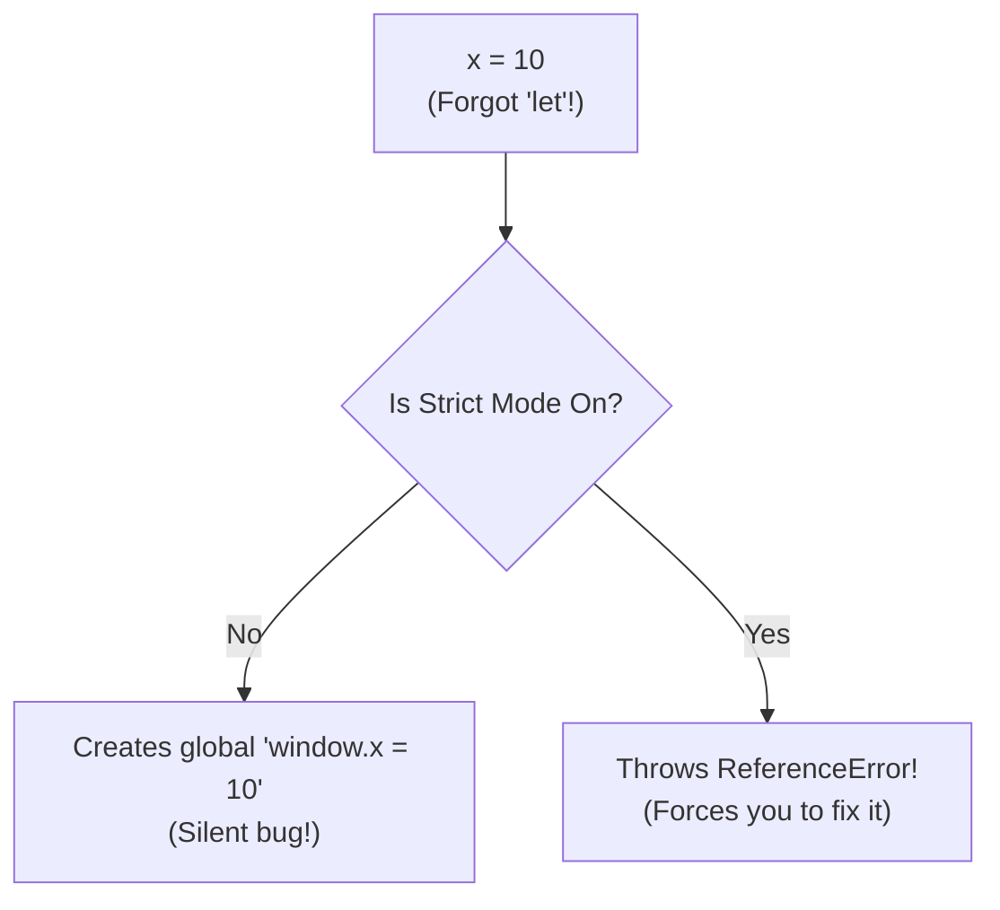

## TL;DR

`"use strict";` is a directive that enables **Strict Mode** in JavaScript. It alters the engine's behavior to throw actual errors for "silent" mistakes (like using undeclared variables), disables dangerous features, and generally enforces better coding practices.

## Mental Model



## How It Works

JavaScript was originally designed to be very forgiving to prevent websites from crashing completely due to minor typos. This "Sloppy Mode" leads to horrific bugs. Strict Mode patches this.

**Key changes in Strict Mode:**
1. **No accidental globals:** Assigning a value to an undeclared variable (`x = 5`) throws an error instead of creating `window.x`.
2. **Safer `this`:** In a regular function, `this` is `undefined` instead of defaulting to the global `window` object.
3. **No duplicate parameters:** `function(a, a)` throws a SyntaxError.
4. **Read-only errors:** Assigning to `NaN` or a `const`-like property throws an error instead of failing silently.

You enable it by placing the string `"use strict";` at the very top of a file or the top of a function.

## Example

```javascript
// --- Sloppy Mode ---
function sloppy() {
    typoVar = 100; // Oops, forgot 'let'. 
    console.log("I just created a global variable accidentally.");
}
sloppy();
console.log(window.typoVar); // 100

// --- Strict Mode ---
function strictly() {
    "use strict";
    badVar = 200; // ReferenceError: badVar is not defined!
}
strictly();
```

## Common Output Question

```javascript
"use strict";

function getThis() {
  return this;
}

console.log(getThis());
```
**Q: What does this output and why?**
**A:** `undefined`. 
In sloppy mode, calling a standalone function makes `this` default to the global object (`window` or `global`). In strict mode, this dangerous default is removed, and `this` remains `undefined`.

## Senior Interview Question

**Q: If ES6 Modules are used, do I still need to write `"use strict";`?**

**A:** No. Code inside ES6 Modules (`import` / `export`) and code inside ES6 Classes (`class User {}`) are in Strict Mode automatically and permanently. There is no way to opt-out of it. Modern React, Angular, and Node applications that use module bundlers are executing entirely in strict mode by default.
