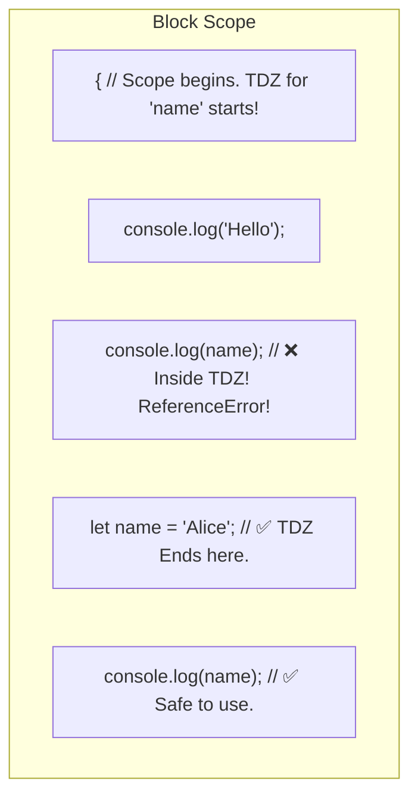

## TL;DR

The **Temporal Dead Zone (TDZ)** is the period of time between the start of a block scope and the exact line where a `let` or `const` variable is declared. If you try to access the variable during this zone, JavaScript will aggressively throw a `ReferenceError`.

## Mental Model



## How It Works

A common misconception is that `let` and `const` are not hoisted. **They ARE hoisted!** The engine knows they exist during the Creation Phase. 

However, unlike `var` (which is initialized with `undefined`), `let` and `const` are kept in an *uninitialized* state. Any attempt to read or write to them before the engine physically evaluates their declaration line results in a crash. 
The TDZ is a security feature to ensure developers don't use variables before properly assigning them.

## Example

```javascript
{
  // TDZ for 'age' starts at the beginning of this block
  
  // console.log(age); // ReferenceError: Cannot access 'age' before initialization
  
  const greet = "Hello"; // TDZ for 'age' is STILL active
  
  let age = 25; // TDZ for 'age' officially ends right here.
  
  console.log(age); // 25
}
```

## Common Output Question

```javascript
let x = 10;

function doMath() {
  console.log(x);
  let x = 20;
}

doMath();
```
**Q: What does this output and why?**
**A:** `ReferenceError: Cannot access 'x' before initialization`.
This proves that `let` is hoisted! If `let` wasn't hoisted, `console.log(x)` would just look up the scope chain, find the global `x=10`, and print 10. But because the local `let x = 20` *is* hoisted to the top of the function's scope, it shadows the global variable. However, because it's caught in the TDZ until the assignment line, printing it crashes the app.

## Senior Interview Question

**Q: Is the Temporal Dead Zone spatial (based on lines of code) or temporal (based on time of execution)?**

**A:** It is **Temporal** (time-based). The TDZ is based on the *order of execution*, not where the code is physically written. 
For example:
```javascript
function sayHi() {
    console.log(msg); // Written BEFORE 'let msg'
}
let msg = "Hi"; // Executed BEFORE sayHi() is called
sayHi();
```
This code works perfectly. Even though the `console.log` is physically above the declaration, by the time `sayHi()` is actually *invoked* (time), the `let msg` line has already executed, meaning the TDZ is over.
