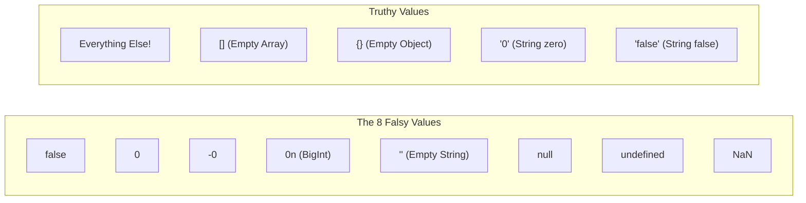

## TL;DR

In JavaScript, you don't need a strict boolean (`true`/`false`) inside an `if` statement. When you put *any* value inside an `if (value)`, JavaScript automatically coerces it into a boolean.
There are exactly **8 Falsy values**. Everything else in the universe is **Truthy**.

## Mental Model



## How It Works

When JavaScript evaluates a context that requires a boolean (like `if`, `while`, or the `!` operator), it performs a hidden `Boolean(value)` conversion.

If you memorize the 8 Falsy values, you never have to guess.
**The Big Traps:**
- An empty array `[]` is an object. Objects are truthy.
- An empty object `{}` is truthy.
- The string `"false"` is truthy (because it's a non-empty string).

## Example

```javascript
// A common pattern: assigning a default value using the OR operator (||)
// The || operator returns the first Truthy value it finds.
let userInput = ""; // Falsy
let username = userInput || "Anonymous";
console.log(username); // "Anonymous"

// Using the NOT operator (!) to force boolean coercion
console.log(!0);       // true (0 is falsy, !falsy is true)
console.log(!!"hello"); // true (Double-bang trick to cast to boolean)

if ([]) {
    console.log("Empty arrays are Truthy!");
}
```

## Common Output Question

```javascript
console.log([] == false);
if ([]) {
    console.log("Wait, what?");
}
```
**Q: Does the `if` block execute?**
**A:** Yes, it prints "Wait, what?".
This is the ultimate JavaScript madness.
1. `[] == false` is `true`. (Because of loose equality coercion, `[]` becomes `""`, which becomes `0`. `false` becomes `0`. `0 == 0`).
2. However, inside an `if ([])` statement, loose equality is NOT used. It just checks if the value itself is Truthy. Arrays are objects, and ALL objects are Truthy. So the block executes.

## Senior Interview Question

**Q: Why is using `||` to assign default values dangerous, and what modern operator replaces it?**

**A:** Using `||` is dangerous if `0` or `""` are actually valid, intentional inputs from the user. Because they are Falsy, the `||` operator will accidentally overwrite them with the default value!
```javascript
let volume = 0; // The user muted the video!
let finalVolume = volume || 100; // Bug! Volume is now 100!
```
To fix this, ES2020 introduced the **Nullish Coalescing Operator (`??`)**. It ONLY falls back to the default if the left side is exactly `null` or `undefined`.
`let finalVolume = volume ?? 100; // Correctly stays 0!`
