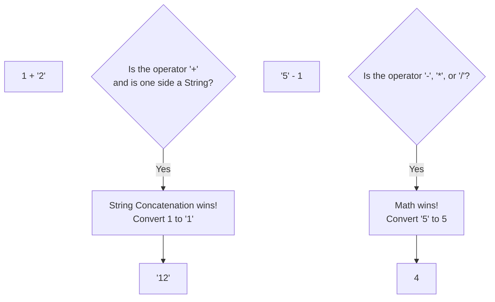

## TL;DR

**Type Coercion** is the automatic or implicit conversion of values from one data type to another (e.g., Number to String). Because JavaScript is dynamically typed, the engine tries to "help" you when you mix types, often leading to bizarre and unexpected results.

## Mental Model



## How It Works

There are two types of coercion:
1. **Explicit Coercion**: You do it intentionally using functions like `Number("5")` or `String(10)`.
2. **Implicit Coercion**: The engine does it automatically when you use operators (`+`, `-`, `==`, `>`) on mismatched types.

**The Golden Rules of Implicit Coercion:**
- The `+` operator has dual purposes (Math and String Concatenation). If *either* side is a string, it prefers strings. It converts the other side to a string and concatenates them.
- The `-`, `*`, `/` operators are strictly for Math. They will force strings into numbers.
- If it tries to force a string like `"apple"` into a number, the result is `NaN`.

## Example

```javascript
// --- The + Operator (String Preference) ---
console.log(1 + "2");      // "12" (Number -> String)
console.log("5" + true);   // "5true" (Boolean -> String)

// --- The -, *, / Operators (Math Preference) ---
console.log("10" - 2);     // 8 (String -> Number)
console.log("10" * "2");   // 20
console.log("5" - true);   // 4 (true -> 1)
console.log("5" - false);  // 5 (false -> 0)

// --- The Madness ---
console.log("apple" - 1);  // NaN (Cannot convert "apple" to a number)
```

## Common Output Question

```javascript
console.log(1 + 2 + "3");
console.log("1" + 2 + 3);
```
**Q: What is the output?**
**A:**
`"33"`
`"123"`
JavaScript evaluates expressions from left to right.
1. `1 + 2` is normal math (`3`). Then `3 + "3"` triggers string concatenation (`"33"`).
2. `"1" + 2` triggers string concatenation (`"12"`). Then `"12" + 3` triggers string concatenation again (`"123"`).

## Senior Interview Question

**Q: Explain how implicit coercion works when trying to add two Objects together (`{} + {}`).**

**A:** When JavaScript attempts to coerce an Object into a primitive (like a string or number), it invokes the object's internal `[[ToPrimitive]]` method. 
By default, this looks for a `valueOf()` method. If that doesn't return a primitive, it falls back to the `toString()` method. 
For a standard object `{}`, `valueOf()` returns the object itself, so it falls back to `toString()`, which returns the string `"[object Object]"`.
Therefore, `{} + {}` coerces both objects to strings and concatenates them, resulting in `"[object Object][object Object]"`.
