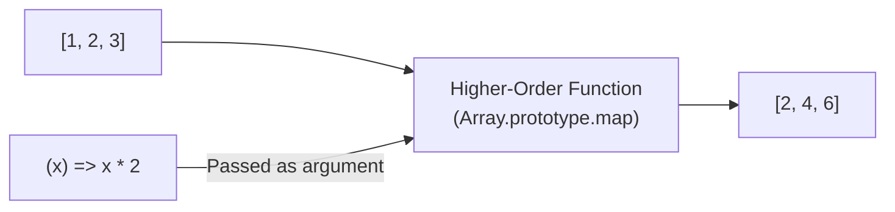

## TL;DR

A Higher-Order Function (HOF) is a function that does at least one of the following:
1. Takes one or more functions as arguments (e.g., callbacks).
2. Returns a function as its result.

## Mental Model



## Example: Built-in HOFs

JavaScript arrays have several built-in higher-order functions:

```javascript
const numbers = [1, 2, 3, 4, 5];

// map: Transforms each element
const doubled = numbers.map(num => num * 2);

// filter: Keeps elements that return true
const evens = numbers.filter(num => num % 2 === 0);

// reduce: Accumulates elements into a single value
const sum = numbers.reduce((acc, curr) => acc + curr, 0);
```

## Example: Custom HOF (Returning a function)

This is heavily used in React (e.g., currying, closures, or custom hooks).

```javascript
// A function that returns another function
function multiplyBy(factor) {
    return function(number) {
        return number * factor;
    }
}

const double = multiplyBy(2);
const triple = multiplyBy(3);

console.log(double(5)); // 10
console.log(triple(5)); // 15
```

## Interview Questions

### What is Currying?
Currying is a technique of evaluating a function with multiple arguments into a sequence of functions, each with a single argument. It relies on HOFs returning functions.
Instead of `add(1, 2)`, currying looks like `add(1)(2)`.
```javascript
const add = a => b => a + b;
```

### Why are Higher-Order Functions useful?
They enable **Declarative Programming** and **Composition**. Instead of writing imperative `for` loops (telling the computer *how* to loop), you use HOFs like `.map()` to state *what* you want to do, leading to cleaner, more composable, and easier-to-test code.

## Common Gotchas

*   **Forgetting to return**: If you use curly braces `{}` in an arrow function passed to a HOF, you *must* use the `return` keyword, or it will return `undefined`.
    `array.map(x => { x * 2 })` // Results in [undefined, undefined...]
    `array.map(x => x * 2)`     // Correct implicit return

## Remember

> Functions in JavaScript are **First-Class Citizens**, meaning they can be assigned to variables, passed around, and returned just like strings or numbers. HOFs are simply functions taking advantage of this fact.
