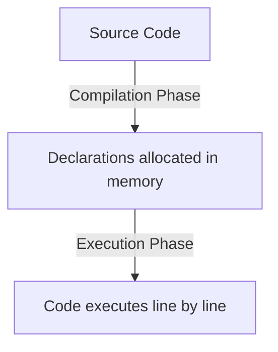

## TL;DR

Hoisting is JavaScript's default behavior of moving variable and function **declarations** (but not initializations) to the top of their current scope before code execution.

## Mental Model



## Example

### Functions
```javascript
sayHello(); // Output: "Hello!"

function sayHello() {
    console.log("Hello!");
}
```

### Variables (`var`)
```javascript
console.log(name); // Output: undefined
var name = "Alice";
```

### Variables (`let` & `const`)
```javascript
console.log(age); // ReferenceError: Cannot access 'age' before initialization
let age = 30;
```

## How It Works

1. During the **compilation phase**, the JavaScript engine parses the code and allocates memory for variable and function declarations.
2. **Function Declarations** are completely hoisted (both name and body). You can call them before they appear in code.
3. **`var` Declarations** are hoisted, but initialized with `undefined`. You can reference them, but their value won't be there until the assignment line runs.
4. **`let` and `const` Declarations** are hoisted, but they are placed in a **Temporal Dead Zone (TDZ)**. You cannot access them before the engine evaluates their assignment line.

## Interview Questions

### Does hoisting apply to Function Expressions or Arrow Functions?
No. If you assign a function to a variable, only the variable declaration is hoisted according to its keyword (`var`, `let`, or `const`).
```javascript
greet(); // TypeError: greet is not a function (if using var, greet is undefined)

var greet = function() {
    console.log("Hi");
};
```

### What is the Temporal Dead Zone (TDZ)?
The period between the entering of a block scope and the execution of a `let` or `const` declaration where the variable cannot be accessed.

### What takes precedence: variable or function hoisting?
Function declarations are hoisted *before* variable declarations. If a `var` and a `function` share the same name, the function wins during the hoisting phase (unless the `var` is initialized, which overwrites it during execution).

## Common Gotchas

*   Assuming `let` and `const` are not hoisted. They *are* hoisted (which is why they throw a `ReferenceError` instead of falling back to a variable in an outer scope), but they remain uninitialized in the TDZ.

## Remember

> **Declarations** are hoisted. **Initializations** are not.
