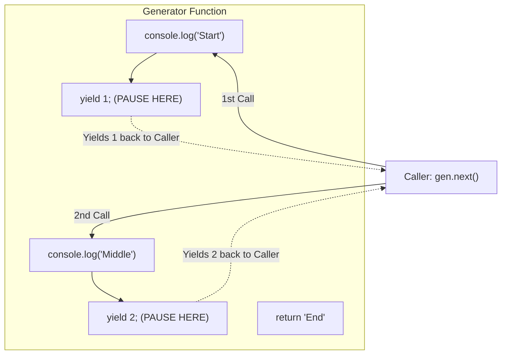

## TL;DR

A **Generator** is a special type of function that can pause its execution midway through, return a value, and then resume execution from exactly where it left off. They are denoted by an asterisk `function*` and use the `yield` keyword to pause.

## Mental Model



## How It Works

When you call a standard function, it runs continuously until it hits `return` or the closing brace.
When you call a generator function `const gen = myGenerator()`, **no code executes**. Instead, it returns a special **Iterator Object**.

When you call `gen.next()`, the function finally starts executing. It runs until it hits the first `yield` keyword. It returns the yielded value, and then completely "freezes" its execution state (preserving all local variables). The next time you call `gen.next()`, it unfreezes and continues.

## Example

```javascript
// 1. Defined with function*
function* numberGenerator() {
  console.log("Generator started...");
  yield 1; // Pauses here!
  
  console.log("Generator resumed...");
  yield 2; // Pauses here!
  
  return 3; // Ends the generator
}

// 2. Calling it doesn't run it! It returns an iterator.
const gen = numberGenerator();

// 3. We manually step through the function
console.log(gen.next()); 
// Output: "Generator started..."
// Returns: { value: 1, done: false }

console.log(gen.next()); 
// Output: "Generator resumed..."
// Returns: { value: 2, done: false }

console.log(gen.next()); 
// Returns: { value: 3, done: true }
```

## Common Output Question

```javascript
function* infiniteCounter() {
  let i = 0;
  while (true) {
    yield i++;
  }
}

const counter = infiniteCounter();
console.log(counter.next().value);
console.log(counter.next().value);
```
**Q: Doesn't a `while (true)` loop crash the browser? What does this output?**
**A:** It outputs `0` then `1`. 
The browser does NOT crash. Because `yield` pauses the function's execution entirely and returns control to the main thread, the infinite loop never runs amok. It only executes a single iteration every time you manually call `next()`. Generators are perfect for creating infinite streams of data safely.

## Senior Interview Question

**Q: In modern JavaScript, Async/Await has largely replaced Generators for handling asynchronous code (which libraries like Redux-Saga still use). How are Async/Await and Generators related under the hood?**

**A:** Async/Await is actually built on top of Generators and Promises. Before ES8 introduced `async/await`, developers used tools like `co` to write synchronous-looking code using Generators.
An `async` function is fundamentally a Generator function that automatically runs itself. When the engine encounters an `await` keyword, it behaves identically to a `yield` keyword—it pauses the function and yields the Promise back to the event loop runner. When the Promise resolves, the runner automatically calls `.next(result)` on the generator to resume it.
