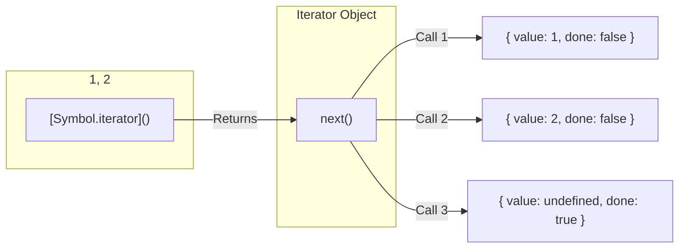

## TL;DR

In JavaScript, an **Iterable** is any object that allows its contents to be looped over (like Arrays, Strings, Maps, and Sets). 
Under the hood, an Iterable must implement a specific method keyed by `Symbol.iterator`. This method returns an **Iterator**—an object equipped with a `next()` function that produces values one by one until it signals it is done.

## Mental Model



## How It Works

The **Iterator Protocol** is the engine that powers modern JavaScript syntax. Whenever you use a `for...of` loop, the Spread Operator (`...`), or Destructuring (`const [a, b] = arr`), JavaScript is silently calling `next()` on the iterator under the hood.

**By default, standard Objects `{}` are NOT iterable.** You cannot use a `for...of` loop on them. If you want to make a custom object iterable, you must manually add the `Symbol.iterator` method to it.

## Example

```javascript
// Let's create a custom object that produces numbers 1 to 3
const range = {
  from: 1,
  to: 3,
  
  // 1. To make it iterable, we must add a method named Symbol.iterator
  [Symbol.iterator]() {
    // 2. It must return an Iterator object
    return {
      current: this.from,
      last: this.to,
      
      // 3. The Iterator MUST have a next() method
      next() {
        if (this.current <= this.last) {
          // 4. Return the next value and done: false
          return { done: false, value: this.current++ };
        } else {
          // 5. Signal that the iteration is over
          return { done: true, value: undefined };
        }
      }
    };
  }
};

// Now our custom object works with modern JS syntax!
for (let num of range) {
  console.log(num); // 1, 2, 3
}

const arr = [...range]; 
console.log(arr); // [1, 2, 3]
```

## Common Output Question

```javascript
const str = "Hi";
const iterator = str[Symbol.iterator]();

console.log(iterator.next().value);
console.log(iterator.next().value);
console.log(iterator.next().done);
```
**Q: What does this output and why?**
**A:** `"H"`, `"i"`, `true`.
Strings are natively iterable in JavaScript. By manually calling the hidden `Symbol.iterator` method, we get the iterator object. We then manually call `.next()` to step through the string one character at a time. The third call returns `{ value: undefined, done: true }`, so `.done` is `true`.

## Senior Interview Question

**Q: Explain the difference between `for...in` and `for...of`.**

**A:** 
- **`for...in`**: Loops over the **enumerable property keys (strings)** of an object. It is designed for generic objects (`{ a: 1, b: 2 }`). If used on an array, it returns the string indexes (`"0"`, `"1"`), which is usually not what you want. It also iterates over inherited prototype properties!
- **`for...of`**: Loops over the **values** generated by an Iterable object (Arrays, Maps, Sets). It expects the `Symbol.iterator` protocol. It cannot be used on standard objects because they do not implement iterators by default.
