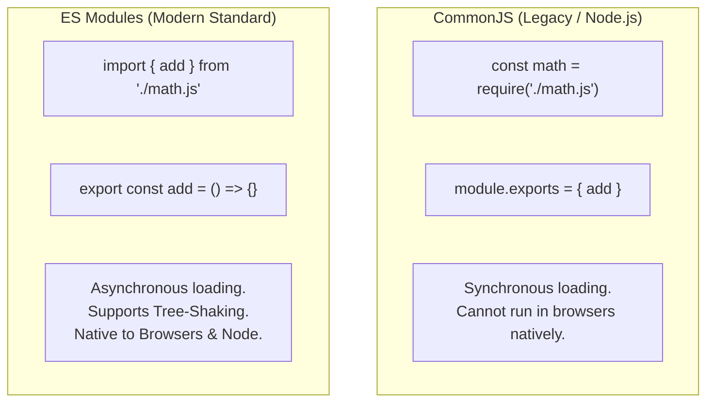

## TL;DR

Historically, JavaScript had no built-in way to import files. Node.js invented **CommonJS** (`require()` and `module.exports`) to solve this. Later, JavaScript officially introduced **ES Modules (ESM)** (`import` and `export`) into the language specification. ESM is the modern standard for both browsers and Node.js.

## Mental Model



## How It Works

**CommonJS (CJS):**
- Uses `require()` and `module.exports`.
- It loads files **synchronously**. It reads the file from disk, blocks the main thread, executes the file, and returns the object.
- Because it is dynamic (you can write `require()` inside an `if` statement), build tools cannot easily analyze what code is actually being used.

**ES Modules (ESM):**
- Uses `import` and `export`.
- It loads files **asynchronously**. The JavaScript engine parses the `import` statements at the very beginning (compile time) before executing any code.
- Because imports must be at the top level (static), build tools (like Webpack/Vite) can analyze the import graph and perform **Tree Shaking** (stripping out unused functions to make the final bundle smaller).

## Example

```javascript
// --- CommonJS (math.js) ---
function add(a, b) { return a + b; }
module.exports = { add };

// CommonJS (app.js)
const math = require('./math.js');
console.log(math.add(2, 3));


// --- ES Modules (math.mjs) ---
export const add = (a, b) => a + b;
export default function multiply(a, b) { return a * b; }

// ES Modules (app.mjs)
// Note: Named imports use {}, Default imports do not.
import multiply, { add } from './math.mjs';
console.log(add(2, 3));
console.log(multiply(2, 3));
```

## Common Output Question

```javascript
// counter.js
let count = 0;
export const increment = () => count++;
export const getCount = () => count;

// app.js
import { increment, getCount } from './counter.js';
increment();
increment();
console.log(getCount());
```
**Q: What does this output and why? Is the module executed multiple times if imported in multiple files?**
**A:** Output is `2`. 
Modules are **Singletons**. The very first time a module is imported, the JS engine executes the file and caches the result. If 10 other files `import './counter.js'`, they all receive a reference to the *exact same cached instance*. Therefore, the `count` state is shared across the entire application.

## Senior Interview Question

**Q: Explain the difference between default exports and named exports, and why many senior engineers advocate against using default exports?**

**A:** 
- **Default Export**: You can export one thing per file (`export default class User`). When importing, you can name it whatever you want (`import CustomName from './user.js'`).
- **Named Export**: You export specific variables (`export const name = "Alice"`). When importing, you must use the exact name inside curly braces (`import { name } from './user.js'`).

**Why avoid default exports?**
1. **Refactoring:** If you rename a class, IDEs (like VSCode) can easily find and rename all `import { User }` statements. But if you used default exports, developers might have imported it as `import UserCtrl`, `import UserMgr`, etc., making automatic refactoring impossible.
2. **Discoverability:** Named imports support excellent auto-completion. If you start typing `add`, the IDE knows exactly which file exports `add` and auto-imports it. Default exports do not provide this.
