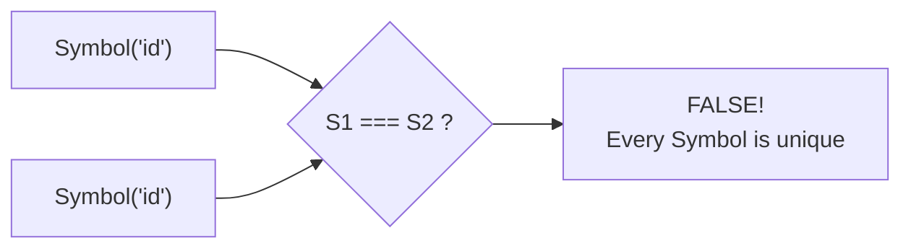

## TL;DR

Introduced in ES6, a **Symbol** is a primitive data type that is guaranteed to be 100% unique. Even if you create two Symbols with the exact same description, they are not equal. They are primarily used as hidden property keys on objects to prevent naming collisions.

## Mental Model



## How It Works

Historically, JavaScript object keys could only be Strings. If two developers imported the same object and both tried to add an `id` property to it, the second developer would accidentally overwrite the first developer's data.

By using a `Symbol` as the key, you guarantee that your property will never collide with any other property, even if they have the same name. 
Furthermore, properties keyed by Symbols are "hidden"—they do not show up in standard `for...in` loops or `Object.keys()`.

## Example

```javascript
// 1. Guaranteed Uniqueness
const sym1 = Symbol("myKey");
const sym2 = Symbol("myKey");
console.log(sym1 === sym2); // false

// 2. Preventing Naming Collisions on Objects
const user = {
  name: "Alice",
  age: 25
};

const idSymbol = Symbol("id");
// Adding a hidden property using bracket notation
user[idSymbol] = 12345;

// If a third-party library also tries to add an "id", it won't overwrite ours!
user.id = "UUID-999"; 

// 3. Hidden from standard loops
console.log(Object.keys(user)); // ["name", "age", "id"]
// Notice that the Symbol is missing from the keys list!

// To read the symbol, you must have access to the original symbol variable
console.log(user[idSymbol]); // 12345
```

## Common Output Question

```javascript
const globalSym1 = Symbol.for("app.id");
const globalSym2 = Symbol.for("app.id");

console.log(globalSym1 === globalSym2);
```
**Q: What does this output and why?**
**A:** `true`.
While standard `Symbol()` creates a completely unique token every time, `Symbol.for()` uses the **Global Symbol Registry**. It checks if a symbol with that exact string key already exists in the global registry. If it does, it returns the *existing* symbol instead of creating a new one. This is useful for sharing symbols across different modules or iframes.

## Senior Interview Question

**Q: What are "Well-Known Symbols" in JavaScript?**

**A:** Well-Known Symbols are built-in Symbols provided by the JavaScript engine that allow developers to hook into core language behaviors. For example:
- `Symbol.iterator`: Allows you to define how an object behaves in a `for...of` loop.
- `Symbol.toPrimitive`: Allows you to define exactly how an object should behave when coerced into a string or number (e.g., overriding the `[object Object]` default).
- `Symbol.hasInstance`: Allows you to customize the behavior of the `instanceof` operator.
They provide metaprogramming capabilities previously reserved only for the JS engine itself.
